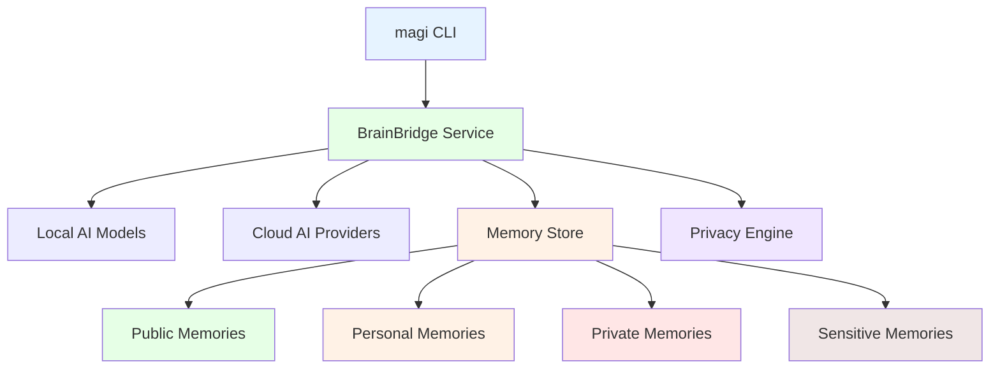
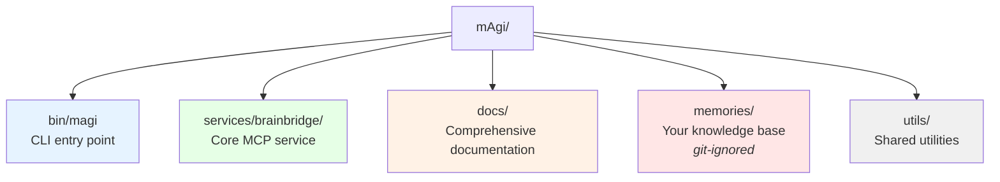

# mAgi
[](LICENSE)
[](CHANGELOG.md)
[](package.json)
[](docs/integrations/CLAUDE.md)

> **Your Personal AI That Remembers What Matters to You**

The other day I fixed my printer (wrong Wi-Fi network 🙃) and jotted a note about it. Then it hit me: that note would probably vanish into the abyss of my drive.

That's what pushed me to build **mAgi** — your personal AI that remembers what matters to you. Instead of losing notes like that printer fix, you can just ask: "Hey, how did I fix it?" — and **mAgi** knows. ✨🧙

---

## ✨ What is mAgi?

**mAgi** is a personal AI knowledge system that bridges the gap between human memory and AI assistance. It learns from your experiences, remembers your preferences, and provides contextual help—all while keeping your data completely under your control.

### 🎯 The Core Problem

- **Knowledge Scatter**: Valuable insights get lost across notes, conversations, and memory
- **Context Loss**: AI assistants lack your personal context and learned lessons  
- **Privacy Concerns**: Your knowledge shouldn't be training data for corporate AI

### 💡 The mAgi Solution

```bash
# Generic AI Response
"Help me debug this React component"
→ Generic troubleshooting steps

# Personal AI with mAgi
"magi help me debug this React component"  
→ Remembers your past React debugging patterns
→ Knows your preferred debugging tools and approaches
→ Recalls similar issues you've solved before
```

## 🏗️ Architecture Overview

mAgi operates as a **hybrid architecture** combining local AI processing with optional cloud AI integration:



### 🧠 Core Components

| Component | Purpose | Technology |
|-----------|---------|------------|
| **magi CLI** | Unified command interface | Node.js, Commander |
| **BrainBridge** | MCP-compatible AI service | TypeScript, FAISS |
| **Memory Store** | Privacy-aware knowledge base | Markdown, YAML |
| **Privacy Engine** | Smart categorization & consent | Local LLM, Rule-based |
| **Multi-Provider AI** | OpenAI, Gemini, Local models | OpenAI SDK, Ollama |

## 🚀 Quick Start

### Prerequisites
- **Node.js 22+** - `node --version`
- **Git** - `git --version`  
- **8GB+ RAM** (for local AI models)

### One-Command Install
```bash
git clone https://github.com/your-org/mAgi.git
cd mAgi
npm run magi
```

**That's it!** The `magi` command handles:
- ✅ Dependency installation
- ✅ AI model setup (Ollama)  
- ✅ Memory structure creation
- ✅ Service startup and health checks

### Verify Installation
```bash
magi status    # System health check
magi save "My first memory: magi is working!"
magi what did I just save?
```

## 🎮 Usage Examples

### 💾 Save Knowledge
```bash
# Quick save via CLI
magi save "When debugging Node.js memory leaks, use --inspect-brk and Chrome DevTools"

# Via Claude Code MCP integration  
"magi save 'Meeting insight: Team prefers async standups on Mondays'"
```

### 🔍 Query Your Knowledge
```bash
# Direct questions
magi how do I debug Node.js memory leaks?

# Contextual queries in Claude Code
"magi what does my team prefer for standups?"
```

### 🛠️ System Management
```bash
magi start     # Start background service
magi status    # Health check with diagnostics
magi logs      # View service logs  
magi stop      # Stop background service
```

## 🔒 Privacy by Design

### 🏠 Privacy Levels
```
memories/
├── public/          🌍 Shareable knowledge
├── team/           👥 Work context only  
├── personal/       🏠 Personal life context
├── private/        🔒 Local AI only
└── sensitive/      🚨 Maximum protection
```

### 🧠 Smart Categorization
- **Automatic Classification**: AI analyzes content and suggests privacy levels
- **Confidence Scoring**: High-confidence auto-categorization, low-confidence asks user
- **Learning System**: Improves suggestions based on your corrections
- **Privacy Bias**: When uncertain, chooses more restrictive privacy level

### ✋ Consent Engine
- **Explicit Permissions**: AI requests access to specific memory categories
- **Granular Control**: Approve/deny at file, topic, or requester level
- **Audit Trail**: Complete log of all knowledge access
- **Revokable Access**: Change permissions anytime

## 🤖 AI Provider Support

| Provider | Models | Use Case | Setup |
|----------|---------|----------|-------|
| **Local (Ollama)** | LLaMA 3.1, Mistral | Privacy-first, offline | `npm run ai:pull` |
| **OpenAI** | GPT-4, GPT-4-turbo | Advanced reasoning | Add `OPENAI_API_KEY` |
| **Google Gemini** | Gemini Pro, Flash | Fast responses | Add `GOOGLE_API_KEY` |

### Provider Fallback
mAgi automatically switches between providers based on availability:
1. **Local AI** (if available)
2. **OpenAI** (if API key provided)  
3. **Gemini** (if API key provided)

## 📚 Integration Examples

### Claude Code (MCP)
```json
// Claude Code MCP Settings
{
  "mcpServers": {
    "magi": { "command": "magi", "args": ["mcp"] }
  }
}
```

### CLI Workflows
```bash
# Daily development workflow
magi start                    # Start service
magi save "Today's insight"   # Quick knowledge capture
magi help with code review    # Contextual assistance
magi stop                     # End of day

# Troubleshooting workflow  
magi status                   # Identify issues
magi logs                     # View diagnostics
magi restart                  # Reset if needed
```

## 📊 Performance & Scale

### Benchmarks (Local Hardware)
- **Memory Search**: < 100ms for 10K+ memories
- **Knowledge Indexing**: ~1GB RAM for 50K memories
- **Startup Time**: < 5 seconds (with cached models)
- **Privacy Classification**: < 50ms per memory

### Resource Usage
- **Disk**: ~2GB (AI models) + your memories
- **RAM**: 4-8GB (depending on AI model size)
- **CPU**: Minimal idle, moderate during AI inference

## 🛠️ Development

### Architecture


### Development Setup
```bash
git clone https://github.com/your-org/mAgi.git
cd mAgi
npm install
npm run dev                   # Start development server
npm run test                  # Run test suite
```

### Contributing
- 📖 **Documentation**: [Contributing Guide](docs/project-management/CONTRIBUTING.md)
- 🏗️ **Architecture**: [System Design](docs/architecture/ARCHITECTURE.md)
- 🔐 **Privacy**: [Privacy Design](docs/architecture/PRIVACY_DESIGN.md)

## 📖 Documentation

### Getting Started
- 🚀 **[Quick Start Guide](docs/setup/GETTING_STARTED.md)** - Zero to working in 15 minutes
- ⚙️ **[Claude Code Setup](docs/setup/CLAUDE_CODE_SETUP.md)** - MCP integration
- 🏥 **[Diagnostics Guide](docs/user-guides/DIAGNOSTICS.md)** - Troubleshooting

### User Guides  
- 📋 **[Command Reference](docs/user-guides/COMMANDS.md)** - Complete CLI documentation
- 🔧 **[Configuration](docs/user-guides/WAKE_WORD_CONFIG.md)** - Customization options

### Architecture
- 🏗️ **[System Architecture](docs/architecture/ARCHITECTURE.md)** - Technical deep-dive
- 🔒 **[Privacy Design](docs/architecture/PRIVACY_DESIGN.md)** - Privacy-first principles
- 🗺️ **[Roadmap](docs/architecture/ROADMAP.md)** - Future development

## 🌟 Why Choose mAgi?

### For Developers
- **Local-First**: Your code insights stay private
- **Context-Aware**: Remembers your debugging patterns, preferred solutions
- **Tool Integration**: Works with your existing development workflow

### For Knowledge Workers
- **Meeting Memory**: Captures and recalls team decisions, preferences
- **Project Context**: Maintains continuity across long-term projects  
- **Learning Acceleration**: Builds on your accumulated expertise

### For Privacy-Conscious Users
- **Data Sovereignty**: You own and control all your knowledge
- **Transparent AI**: See exactly what AI can access and when
- **Local Processing**: Sensitive data never leaves your machine

## 🤝 Community & Support

### Get Help
- 📚 **Documentation**: Comprehensive guides in `/docs`
- 🐛 **Issues**: [GitHub Issues](https://github.com/your-org/magi/issues)
- 💬 **Discussions**: [GitHub Discussions](https://github.com/your-org/magi/discussions)

### Share Your Experience  
- ⭐ **Star this repo** to follow development
- 📢 **[Release Notes](CHANGELOG.md)** for version updates
- 💭 **Share your use cases** - How are you using magi?
- 🔁 **Spread the word** about privacy-first AI

## 📄 License & Legal

mAgi is released under a **custom license** that prioritizes:
- ✅ **Personal Use**: Free for individuals and developers
- ✅ **Open Source**: Full source code transparency  
- ✅ **Privacy Protection**: Legal guarantees about data handling
- ⚖️ **Commercial Terms**: Fair licensing for business use

See [LICENSE](LICENSE) for complete terms.

---

<div align="center">

**Built by Igor Ramos**

*It started as an experiment, but it's also the kind of work I love — chasing a thread of curiosity, turning it into something real, and exploring what AGI feels like when it becomes personal.*

[⭐ Star](https://github.com/your-org/magi) • [📖 Docs](docs/) • [🐛 Issues](https://github.com/your-org/magi/issues) • [💬 Discuss](https://github.com/your-org/magi/discussions)

</div>