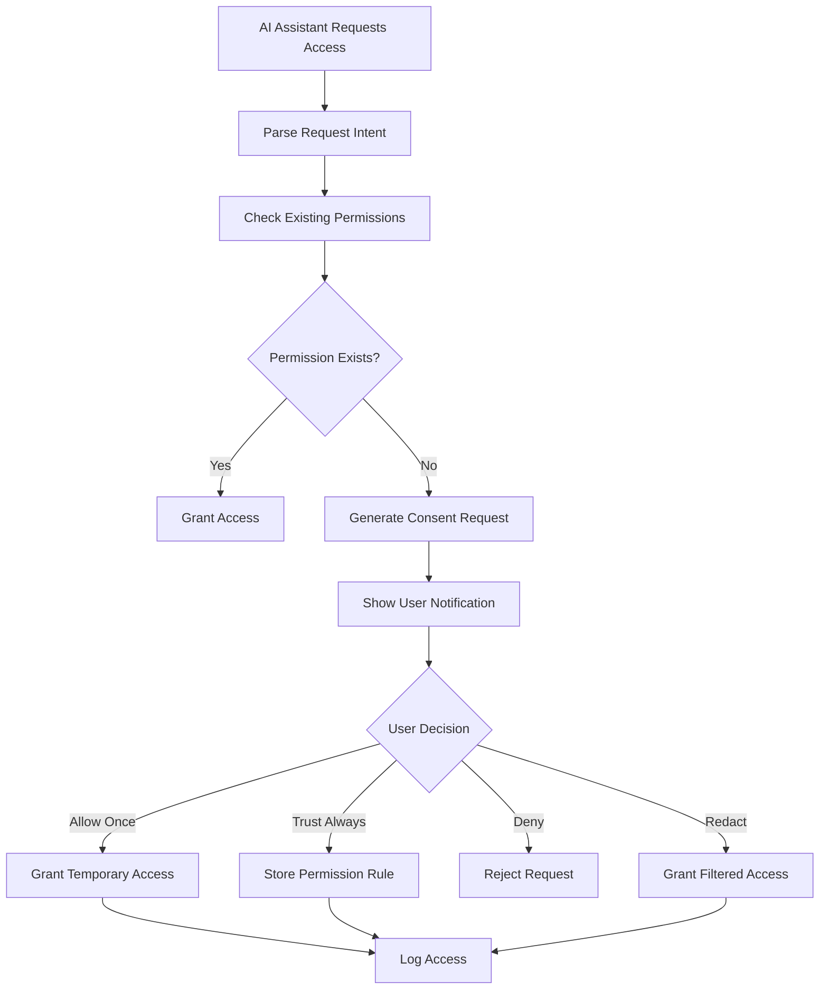

# Privacy & Consent System Design

> **Vision**: You are the gatekeeper of your own knowledge. Every access request requires your explicit consent.

## 🎯 Core Principles

1. **Privacy by Default**: Everything is private unless explicitly shared
2. **Informed Consent**: You always know who wants what and why  
3. **Granular Control**: Control access at file, topic, and requester level
4. **Audit Trail**: Full history of what was accessed when and by whom
5. **Revocable Access**: Can revoke permissions at any time

## 🏗️ System Architecture

### Privacy Levels (File-based + Directory)

**Directory Structure**:
```
knowledge/
├── public/           # Freely shareable (CC/MIT-like)
├── team/            # Work colleagues only  
├── personal/        # Close friends, family context
├── private/         # Local AI only
└── sensitive/       # Extra protection + consent required
```

**File-level Privacy Tags**:
```markdown
---
privacy: private|personal|team|public|sensitive
tags: [network, troubleshooting, cisco]  
share_with: [claude-code, specific-gpt]
expires: 2024-12-31
redact: [ip-addresses, company-names]
---
# Network Troubleshooting Notes
...
```

## 🔒 Consent System

### Interactive Consent Flow



### Consent Request Format

```typescript
interface ConsentRequest {
  id: string
  timestamp: Date
  requester: {
    name: string           // "ChatGPT", "Claude Web", "Custom Bot"
    type: "local" | "cloud" | "api"
    trustLevel?: number    // 0-100 based on past behavior
  }
  query: {
    intent: string         // "debug network issues"
    searchTerms: string[]  // ["network", "printer", "connectivity"]  
    files: string[]        // ["network-issues.md", "printer-setup.md"]
    privacyLevel: string[] // ["private", "team"] - what levels needed
  }
  purpose: string          // Human readable explanation
  duration?: "once" | "session" | "permanent"
  redactionOptions?: string[] // ["ip-addresses", "names", "passwords"]
}
```

## 🖥️ User Interfaces

### Phase 1: CLI Approval (MVP)
```bash
🔔 Access Request #1729
┌─────────────────────────────────────────────────────┐
│ Requester: ChatGPT (Cloud AI)                      │
│ Intent: Help debug network connectivity issues      │  
│ Query: "network troubleshooting printer setup"     │
│ Files: network-issues.md, printer-setup.md         │
│ Privacy: private, team                              │
└─────────────────────────────────────────────────────┘

[A] Allow once    [T] Trust for this topic    [D] Deny    
[R] Allow with redaction    [V] View files first

Your choice:
```

### Phase 2: Web Dashboard
**URL**: `http://localhost:3001/consent`

**Features**:
- Real-time pending requests  
- Access history timeline
- Permission management (revoke, modify)
- Privacy level editor for files
- Trust score for different AI assistants
- Audit logs with search/filter

### Phase 3: Native Notifications (Future)
- macOS notification center integration
- Quick approve/deny from notification
- Background consent daemon

## 📊 Permission Management

### Permission Rules Storage
```json
{
  "rules": [
    {
      "id": "rule_001", 
      "requester": "claude-code",
      "scope": "local-only",
      "allowed_privacy_levels": ["private", "team", "public"],
      "created": "2025-01-15T10:30:00Z",
      "expires": null,
      "access_count": 47
    },
    {
      "id": "rule_002",
      "requester": "chatgpt", 
      "scope": "network-troubleshooting",
      "allowed_privacy_levels": ["team", "public"],
      "redaction_rules": ["ip-addresses"],
      "created": "2025-01-20T14:15:00Z", 
      "expires": "2025-12-31T23:59:59Z",
      "access_count": 12
    }
  ]
}
```

### Trust Score System
AI assistants build trust over time:
- **New requester**: 0% trust, all requests need approval
- **Good behavior**: +10% trust per successful interaction
- **Bad behavior**: -50% trust, revoke permissions
- **High trust (80%+)**: Auto-approve for known topics

## 🔍 Audit & Transparency

### Access Logs
```json
{
  "access_log": [
    {
      "timestamp": "2025-01-20T15:30:00Z",
      "requester": "chatgpt",
      "files_accessed": ["network-issues.md"],  
      "query": "printer connectivity troubleshooting",
      "consent_id": "consent_456",
      "permission_rule": "rule_002", 
      "redactions_applied": ["192.168.1.x masked"],
      "success": true
    }
  ]
}
```

## 🚀 Implementation Phases

### Phase 1: MVP (Privacy Basics)
**Timeline**: 1-2 weeks
- [ ] Directory-based privacy levels
- [ ] Basic file privacy tags
- [ ] CLI consent prompts
- [ ] Simple permission storage
- [ ] Access logging

### Phase 2: Web Dashboard
**Timeline**: 2-3 weeks  
- [ ] Web UI for consent management
- [ ] Real-time request notifications
- [ ] Permission rule editor
- [ ] Access history visualization
- [ ] Trust score system

### Phase 3: Advanced Features  
**Timeline**: 1-2 months
- [ ] Smart redaction system
- [ ] Native OS notifications
- [ ] API for third-party integrations
- [ ] Advanced search in consent system
- [ ] Export/import privacy settings

## 🛠️ Technical Architecture

### Components
1. **Privacy Engine** - Evaluates access requests
2. **Consent Manager** - Handles user interactions  
3. **Permission Store** - Persistent rule storage
4. **Audit Logger** - Tracks all access
5. **Redaction System** - Filters sensitive content

### Security Considerations
- All permission data stored locally
- No consent decisions sent to cloud
- Encrypted storage for sensitive rules
- Regular permission review prompts
- Secure token system for session management

---

## 🎯 Success Metrics

**User Control**:
- Time from "feels invasive" to "feels empowering"
- Number of granular permissions actively managed
- Confidence level in sharing knowledge with AI

**Privacy Protection**:  
- Zero accidental sensitive data leaks
- 100% of cloud access requires explicit consent
- Full audit trail for compliance

**Developer Experience**:
- Easy integration for new AI assistants
- Clear API for consent requests
- Minimal friction for legitimate access

---

*This is a living document - update as we build and learn!*