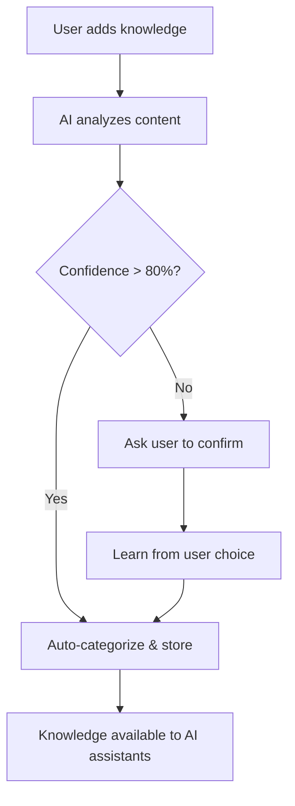

# Smart Auto-Categorization System

> **Vision**: Users capture knowledge naturally. AI handles the tedious categorization work.

## 🧠 Core Principle

**Friction-free capture** → **Smart analysis** → **Human confirmation when needed**



## 🎯 User Experience

### High Confidence (Auto-categorize)
```
You: "Add knowledge: Always check which WiFi you're on before network troubleshooting"
AI:  ✅ Added to public/network-troubleshooting.md (confidence: 92%)
     📋 Tags: network, troubleshooting, wifi, debugging
```

### Medium Confidence (Quick confirmation)
```  
You: "Add knowledge: Client meeting went well, they're interested in Q4 expansion"
AI:  🤔 This looks like team knowledge (confidence: 65%)
     
     Suggested: team/client-interactions.md
     Privacy: team (work colleagues only)
     Tags: client, meetings, expansion, Q4
     
     [Y] Accept  [N] Choose different  [P] Make private instead
You: Y
AI:  ✅ Added to team/client-interactions.md
```

### Low Confidence (Full review needed)
```
You: "Add knowledge: Remember the incident response procedure we discussed"
AI:  ⚠️  I need help categorizing this (confidence: 35%)
     
     Could be:
     🔒 private/  - Internal procedures (confidence: 35%)
     🚨 sensitive/ - Security procedures (confidence: 30%) 
     👥 team/     - Team processes (confidence: 25%)
     
     More context: Is this about security incidents, team processes, or general procedures?
You: "Security incidents - it contains our emergency contacts"
AI:  ✅ Added to sensitive/incident-response.md
     📚 Learning: "incident response" + "emergency contacts" = sensitive/
```

## 🔍 Privacy Classification Rules

### High Confidence Indicators

**Public Knowledge** (90%+ confidence):
- ✅ General programming tips: "use git rebase for clean history"
- ✅ Open source insights: "React hooks pattern works well for..."
- ✅ Public troubleshooting: "DNS issues often cause..."
- ✅ Learning resources: "This book taught me..."

**Team Knowledge** (85%+ confidence):
- ✅ Team processes: "our deployment process", "how we handle code reviews"
- ✅ Work tools: "we use Jira for", "our Slack channels"
- ✅ Project specifics: "the API refactor went well"
- ✅ Company-specific (non-sensitive): "our engineering culture"

**Private Knowledge** (80%+ confidence):
- ✅ Business strategy: "competitive analysis shows", "my client strategy"
- ✅ Financial insights: "pricing strategy", "revenue patterns"
- ✅ Personal professional: "my career goals", "networking insights"

**Sensitive Knowledge** (85%+ confidence):
- ✅ Security mentions: "incident response", "security procedure", "emergency contacts"
- ✅ Legal contexts: "compliance issue", "legal strategy", "regulatory"
- ✅ Explicit sensitivity: "confidential", "classified", "restricted"

### Confidence-Lowering Signals
- 🤔 **Ambiguous pronouns**: "we", "our", "they" (who specifically?)
- 🤔 **Mixed contexts**: Contains both technical and personal elements
- 🤔 **Unclear scope**: Could apply to multiple privacy levels
- 🤔 **New terminology**: Words not seen in training examples

## 🧮 AI Classification Algorithm

### Step 1: Content Analysis
```typescript
interface ContentAnalysis {
  sensitiveTerms: string[]        // passwords, SSN, API keys
  businessTerms: string[]         // client, revenue, strategy  
  personalTerms: string[]         // family, personal, private
  technicalTerms: string[]        // debugging, git, deployment
  teamTerms: string[]            // our team, we use, our process
  securityTerms: string[]        // incident, breach, compliance
}
```

### Step 2: Privacy Scoring
```typescript
function classifyPrivacy(content: string): PrivacySuggestion {
  const scores = {
    public: calculatePublicScore(content),
    team: calculateTeamScore(content),
    personal: calculatePersonalScore(content), 
    private: calculatePrivateScore(content),
    sensitive: calculateSensitiveScore(content)
  }
  
  const topChoice = Object.keys(scores).sort((a, b) => scores[b] - scores[a])[0]
  const confidence = scores[topChoice]
  
  return {
    suggestedLevel: topChoice,
    confidence,
    reasoning: explainChoice(content, topChoice),
    alternatives: getAlternatives(scores)
  }
}
```

### Step 3: Tag Generation
```typescript
function generateTags(content: string, privacyLevel: string): string[] {
  const baseTags = extractKeyTerms(content)
  const contextTags = addContextualTags(content, privacyLevel)
  const domainTags = identifyDomain(content) // work, personal, technical, etc.
  
  return [...baseTags, ...contextTags, ...domainTags]
    .filter(tag => tag.length > 2)
    .slice(0, 8) // Max 8 tags
}
```

## 📚 Learning & Improvement

### User Feedback Loop
Every user correction teaches the system:

```typescript
interface LearningEvent {
  originalContent: string
  aiSuggestion: PrivacySuggestion
  userChoice: {
    privacyLevel: string
    reasoning?: string  // User can explain why AI was wrong
  }
  timestamp: Date
}

// System learns patterns:
// "incident response" + user corrects to sensitive → boost sensitive score
// "client meeting" + user corrects to private → learn user's preference
```

### Personal Preference Learning
```typescript
interface UserPreferences {
  // User tends to keep client info more private than average
  clientInfoBias: 'more_private' | 'standard' | 'more_open'
  
  // User prefers broader vs specific privacy levels
  privacyStyle: 'conservative' | 'balanced' | 'open'
  
  // Custom keywords that trigger specific classifications
  personalKeywords: {
    [keyword: string]: PrivacyLevel
  }
}
```

## 🔄 Implementation Phases

### Phase 1: Rule-Based Classifier
- **Simple keyword matching** with confidence scoring
- **Basic privacy rules** based on content patterns
- **User confirmation** for confidence < 70%
- **Learning storage** for improvement

### Phase 2: Enhanced AI Classification  
- **Local language model** for better context understanding
- **Personal preference learning** from user corrections
- **Advanced tag generation** using semantic analysis
- **Confidence calibration** based on historical accuracy

### Phase 3: Predictive Features
- **Smart file naming** suggestions
- **Related knowledge detection** 
- **Privacy drift warnings** (when content doesn't match file's privacy level)
- **Batch recategorization** when privacy preferences change

## 🎮 User Control & Override

### Always User-Controllable
- ✅ **Override any suggestion** at capture time
- ✅ **Recategorize later** via web dashboard
- ✅ **Set personal rules**: "anything with 'client X' goes to private/"
- ✅ **Batch operations**: "move all Q4 planning notes to team/"
- ✅ **Privacy level promotion/demotion**: Easily change levels

### Smart Defaults
```typescript
// User can set preferences:
const userPrefs = {
  defaultConfidenceThreshold: 75, // Ask for confirmation below this
  autoPromoteToSensitive: ['security', 'legal', 'compliance'],
  neverAutoPublic: ['client', 'salary', 'personal'],
  preferredTagStyle: 'technical' // vs 'casual' vs 'business'
}
```

## 📊 Success Metrics

### User Experience
- **Capture friction**: Time from thought to stored knowledge < 10 seconds
- **Categorization accuracy**: 90%+ of auto-suggestions accepted
- **User satisfaction**: Users report feeling "in control" not "correcting AI"

### System Performance  
- **Classification accuracy**: 85%+ correct on first try
- **Learning rate**: Accuracy improves 5%+ per 100 user corrections
- **Speed**: Classification completes in < 2 seconds

### Privacy Protection
- **Zero accidental exposures**: No sensitive info auto-classified as public
- **Conservative bias**: When uncertain, choose more restrictive privacy level
- **User override rate**: < 15% (system learns user preferences well)

---

**Next Steps**: Update MCP server to support this intelligent knowledge curation workflow!