# mAgi Architecture Overview

> **Personal AI Knowledge Base with Smart Privacy Controls**
> 
> **Status**: v0.1.0 Developer Preview (Core features working, advanced features in development)

## Core Concept

Transform scattered lessons learned into an AI-accessible, privacy-aware memory bank. Users capture insights naturally; AI handles intelligent categorization and privacy protection.

## System Architecture

## Privacy-First Design

### Memory Organization

```mermaid
graph TD
    A[memories/] --> B[public/ 🌍<br/>Anyone can access]
    A --> C[team/ 👥<br/>Work colleagues only]
    A --> D[personal/ 🏠<br/>Close friends/family context]
    A --> E[private/ 🔒<br/>Local AI assistants only]
    A --> F[sensitive/ 🚨<br/>Maximum protection required]
    A --> G[examples/ 📚<br/>Templates and learning materials]
    
    style B fill:#e6ffe6
    style C fill:#e6f3ff
    style D fill:#fff2e6
    style E fill:#ffe6e6
    style F fill:#f0e6e6
    style G fill:#f0f0f0
```

### Smart Categorization Flow
1. **User adds memory** - Natural language, no manual categorization
2. **AI analyzes content** - Privacy classifier with confidence scoring  
3. **Auto-categorize** (high confidence) or **Ask user** (low confidence)
4. **Learn from feedback** - Improve suggestions over time
5. **Store with metadata** - Privacy level, tags, relationships

### Consent System
- **Privacy-aware search** - Respects folder boundaries
- **Interactive consent** - User approves/denies access requests
- **Trust scores** - Reduce friction for trusted AI assistants
- **Complete audit trail** - Track all knowledge access

## Technical Components

### 1. magi CLI System ([MAGI_CLI_DESIGN.md](MAGI_CLI_DESIGN.md))
**Purpose**: Two-layer command interface for personal AI interactions
**Architecture**:
- **Service Layer**: `magi start` - Background MCP service management
- **REPL Layer**: `magi` - Interactive command-line companion
- **Wake Word Ecosystem**: Universal `magi` command prefix for all AI operations
- **Process Management**: Separated service lifecycle from user interaction

### 2. MCP Server (`services/brainbridge/src/server.ts`) ✅ **IMPLEMENTED**
**Purpose**: Bridge between AI assistants and memory bank
**Key features**:
- `ai_save_memory` tool with smart categorization
- `ai_query_memories` tool with privacy filtering
- Resource access for direct file reading
- Multi-provider AI support (OpenAI, Gemini, Ollama)

### 3. Privacy Classifier 🔨 **BASIC IMPLEMENTATION**
**Purpose**: Intelligent privacy level detection
**Current Status**: Basic rule-based categorization in `services/brainbridge/src/services/ai-service.ts`
**Algorithm**:
- Rule-based scoring (keywords, patterns)
- Privacy level suggestion based on content
- Default conservative bias for uncertainty

### 4. Consent Engine 🔮 **PLANNED**
**Purpose**: User control over memory access
**Target**: v0.2.0
**Planned Features**:
- Interactive CLI prompts
- Permission rule storage
- Trust score management  
- Access audit logging

### 5. Memory Store (File system)
**Purpose**: Organized, searchable memory storage
**Structure**:
- Privacy-level directories
- YAML frontmatter for metadata
- Markdown content for readability
- Git-friendly for version control

## Data Flow

### Adding Memories

```mermaid
flowchart TD
    A[User: Add memory about WiFi troubleshooting] --> B[Privacy Classifier analyzes content]
    B --> C[High confidence 92%: public level]
    C --> D[Auto-generate tags:<br/>network, troubleshooting, wifi]
    D --> E[Store in public/<br/>network-troubleshooting.md]
    E --> F[✅ Confirm to user:<br/>Added to public memories]
    
    style A fill:#e6f3ff
    style F fill:#e6ffe6
```

### Searching Memories  

### Consent Flow

## Key Design Principles

### 1. **Privacy by Default**
- New memories start private until classified
- Conservative bias: when uncertain, choose more restrictive
- User always has final control over categorization

### 2. **Friction-Free Capture**
- No manual categorization required
- Smart defaults based on content analysis
- Learn from user corrections over time

### 3. **Informed Consent** 
- Users see exactly what AI wants to access and why
- Granular control: file-level, topic-level, requester-level
- Complete transparency in access decisions

### 4. **Local-First Security**
- Sensitive knowledge never leaves local environment
- Consent decisions stored locally
- Optional remote access with explicit user control

## Implementation Status

### ✅ Phase 0: Foundation (Complete)
- Basic MCP server with search/add tools
- File-based memory storage
- Privacy-level directory structure
- Template system and documentation

### 📋 Phase 1: Smart Privacy (Next - 2-3 weeks)
- Smart auto-categorization with confidence scoring
- CLI consent system for access requests
- User preference learning
- Basic permission storage and audit logging

### 🔮 Phase 2: Web Dashboard (Future - 2-3 weeks)
- Web UI for consent management
- Real-time access request notifications
- Permission rule editor with bulk operations
- Access history visualization

### 🚀 Phase 3: Advanced Features (Future - 1-2 months)
- Enhanced AI classification with local LLM
- Smart content redaction
- Native OS notifications
- Third-party AI assistant integrations

---

*This architecture balances simplicity with powerful privacy controls, ensuring users maintain complete agency over their personal knowledge while enabling seamless AI assistance.*