# AGIfor.me Architecture Summary
## Visual Architecture Guide

> **Complete system architecture with interactive diagrams**

This document provides the definitive visual guide to AGIfor.me's architecture - from the current privacy-first memory system to the full vision of local AI intelligence with context-aware assistance.

## System Overview

### AGIfor.me: Privacy-First Personal AI Knowledge System

### Complete Vision: Local AI with Smart Memory Synthesis

## Smart Memory Processing

### Privacy-Aware Memory Access

```mermaid
graph LR
    subgraph "magi CLI Interface"
        CLI[magi CLI<br/>🧠 Your Personal AI]
    end

    subgraph "Memory Storage (Privacy-Protected)"
        PUB[public/]:::allowed
        TEAM[team/]:::allowed
        PERS[personal/]:::allowed
        PRIV[private/]:::allowed
        SENS[sensitive/]:::allowed
    end

    subgraph "AI Processing"
        CHAT[Chat Model<br/>Context-Aware Synthesis]
        EMBED[Embedding Model<br/>Semantic Search]
        SYNTHESIS[Smart Synthesis<br/>Nap Processing]
    end

    subgraph "Vector Index"
        IDX[.magi-index/<br/>Unified Knowledge Base]
    end

    CLI --> PUB
    CLI --> TEAM
    CLI --> PERS
    CLI --> PRIV
    CLI --> SENS

    CLI --> CHAT
    CLI --> EMBED
    CLI --> SYNTHESIS

    EMBED --> IDX
    SYNTHESIS --> IDX

    classDef allowed fill:#c8e6c9
```

## AI-Powered Knowledge Processing

### Intelligent Query Resolution with Smart Synthesis

### AI-Assisted Knowledge Creation

## Context-Aware Intelligence

### Smart Query Processing

```mermaid
graph TD
    START([User has a question])
    QUERY[User: magi How do I debug React issues?]

    ANALYZE{AI analyzes query context}
    CLASSIFY[Classify query type:<br/>• Question vs Command<br/>• Personal vs Technical<br/>• Recent vs Historical]

    SEARCH[Semantic search across<br/>all privacy levels]
    TEMPORAL[Apply temporal weighting<br/>Recent memories prioritized]

    SYNTHESIS[Smart Synthesis<br/>Generate coherent response]
    RESPONSE[Intelligent answer<br/>Not raw file dumps]

    START --> QUERY
    QUERY --> ANALYZE
    ANALYZE --> CLASSIFY
    CLASSIFY --> SEARCH
    SEARCH --> TEMPORAL
    TEMPORAL --> SYNTHESIS
    SYNTHESIS --> RESPONSE

    style SYNTHESIS fill:#4caf50,color:#fff
    style CLASSIFY fill:#2196f3,color:#fff
    style TEMPORAL fill:#ff9800,color:#fff
    style RESPONSE fill:#e8f5e8
```

## Local AI Brain Architecture

### Complete Technology Stack for Privacy-First AI

## Future Architecture: Network Integration

### mAgi Network (Future Vision)

---

## Mermaid Documentation Guidelines

### Diagram Standards
All architecture diagrams in this document follow these Mermaid conventions:

#### Color Coding

#### Diagram Types Used
- **Graph TB/LR**: System architecture and component relationships
- **SequenceDiagram**: Data flow and interaction patterns
- **Subgraphs**: Logical grouping of related components

### Usage Guide

#### For Developers
- **System Overview**: Start with "Complete Vision" to understand all components
- **Implementation**: Use "AI-Powered Knowledge Processing" for development guidance
- **Smart Synthesis**: Reference "Nap Processing" architecture for synthesis implementation

#### For Users
- **Privacy Model**: Review "Privacy-Aware Memory Access" for privacy guarantees
- **Query Processing**: See "Smart Query Processing" for how magi handles requests
- **Future Vision**: Check "mAgi Network" for roadmap understanding

#### For Contributors
- **Architecture**: Use "Complete Technology Stack" to understand dependencies
- **Feature Planning**: Reference diagrams when proposing new features
- **Documentation**: Keep diagrams updated as system evolves

### Viewing These Diagrams
This document is designed to be viewed through:
- **[architecture-viewer.html](../architecture-viewer.html)** - Interactive web viewer with enhanced Mermaid rendering
- **GitHub/GitLab** - Native markdown with Mermaid support
- **VS Code** - With Mermaid preview extensions
- **Any Mermaid-compatible markdown viewer**

---

*These Mermaid diagrams serve as the living visual foundation for understanding AGIfor.me's evolution from simple memory storage to intelligent, context-aware personal AI.*