# AGIfor.me Architecture Summary
## Visual Architecture Guide

> **Complete system architecture with interactive diagrams**

This document provides the definitive visual guide to AGIfor.me's architecture - from the current privacy-first memory system to the full vision of local AI intelligence with context-aware assistance.

## System Overview

### AGIfor.me: Privacy-First Personal AI Knowledge System


### Complete Vision: Local AI with Multi-Context Intelligence


## Smart Context Separation

### Personal Context: Family & Life Intelligence

```mermaid
graph LR
    subgraph "magic Profile (Like Personal Email)"
        MP[magic CLI<br/>📧 Personal Context]
    end
    
    subgraph "magic-memories/ (Isolated Storage)"
        PUB[public/]:::allowed
        PERS[personal/]:::allowed
        PRIV[private/]:::allowed
        SENS[sensitive/]:::allowed
    end
    
    subgraph "Other Profiles (Inaccessible)"
        BUSINESS[magik-memories/]:::blocked
        DEV[magia-memories/]:::blocked
    end
    
    subgraph "AI Models"
        CHAT[Chat Model<br/>Casual Tone]
        EMBED[Embedding Model]
    end
    
    subgraph "Index"
        IDX[.magic-index/]
    end
    
    MP --> PUB
    MP --> PERS
    MP --> PRIV
    MP --> SENS
    
    MP -.- BUSINESS
    MP -.- DEV
    
    MP --> CHAT
    MP --> EMBED
    EMBED --> IDX
    
    classDef allowed fill:#c8e6c9
    classDef blocked fill:#ffcdd2
```


### Business Context: Professional & Strategic Intelligence

```mermaid
graph LR
    subgraph "magik Profile (Like Work Email)"
        BP[magik CLI<br/>📧 Business Context]
    end
    
    subgraph "magik-memories/ (Isolated Storage)"
        PUB[public/]:::allowed
        TEAM[team/]:::allowed
        PRIV[private/]:::allowed
        SENS[sensitive/]:::allowed
    end
    
    subgraph "Other Profiles (Inaccessible)"
        PERSONAL[magic-memories/]:::blocked
        DEV[magia-memories/]:::blocked
    end
    
    subgraph "AI Models"
        CHAT[Chat Model<br/>Professional Tone]
        EMBED[Embedding Model]
    end
    
    subgraph "Index"
        IDX[.magik-index/]
    end
    
    BP --> PUB
    BP --> TEAM
    BP --> PRIV
    BP --> SENS
    
    BP -.- PERSONAL
    BP -.- DEV
    
    BP --> CHAT
    BP --> EMBED
    EMBED --> IDX
    
    classDef allowed fill:#c8e6c9
    classDef blocked fill:#ffcdd2
```


## AI-Powered Knowledge Processing

### Intelligent Query Resolution


### AI-Assisted Knowledge Creation


## Context-Aware Intelligence

### Smart Context Switching (Email-like UX)
```mermaid
graph TD
    START([User wants to work])
    THINK{What context am I in?<br/>📧 Like choosing email account}
    
    PERSONAL_INTENT[Want to work on<br/>personal/family stuff]
    BUSINESS_INTENT[Want to work on<br/>business/work stuff]
    DEV_INTENT[Want to work on<br/>development/experiments]
    
    SWITCH_MAGIC[magi use magic<br/>📧 Personal Email Mode]
    SWITCH_MAGIK[magi use magik<br/>📧 Business Email Mode]  
    SWITCH_MAGIA[magi use magia<br/>📧 Dev Email Mode]
    
    CONFIRM_MAGIC[Switched to PERSONAL<br/>Business data inaccessible]
    CONFIRM_MAGIK[Switched to BUSINESS<br/>Personal data inaccessible]
    CONFIRM_MAGIA[Switched to DEVELOPMENT<br/>Production data isolated]
    
    USE_MAGIC[magic query "family plans"<br/>magic@personal:~$]
    USE_MAGIK[magik query "Q4 strategy"<br/>magik@business:~$]
    USE_MAGIA[magia query "test features"<br/>magia@dev:~$]
    
    START --> THINK
    THINK --> PERSONAL_INTENT
    THINK --> BUSINESS_INTENT
    THINK --> DEV_INTENT
    
    PERSONAL_INTENT --> SWITCH_MAGIC
    BUSINESS_INTENT --> SWITCH_MAGIK
    DEV_INTENT --> SWITCH_MAGIA
    
    SWITCH_MAGIC --> CONFIRM_MAGIC
    SWITCH_MAGIK --> CONFIRM_MAGIK
    SWITCH_MAGIA --> CONFIRM_MAGIA
    
    CONFIRM_MAGIC --> USE_MAGIC
    CONFIRM_MAGIK --> USE_MAGIK
    CONFIRM_MAGIA --> USE_MAGIA
    
    style SWITCH_MAGIC fill:#2196f3,color:#fff
    style SWITCH_MAGIK fill:#ff9800,color:#fff
    style SWITCH_MAGIA fill:#9c27b0,color:#fff
    style CONFIRM_MAGIC fill:#e8f5e8
    style CONFIRM_MAGIK fill:#fff3e0
    style CONFIRM_MAGIA fill:#f3e5f5
```

## Local AI Brain Architecture

### Complete Technology Stack for Privacy-First AI


## Future Architecture: Network Integration

### mAgi Network (Phase 5)


---

## Mermaid Documentation Guidelines

### Diagram Standards
All architecture diagrams in this document follow these Mermaid conventions:

#### Color Coding


#### Diagram Types Used
- **Graph TB/LR**: System architecture and component relationships
- **SequenceDiagram**: Data flow and interaction patterns
- **Subgraphs**: Logical grouping of related components

### Usage Guide

#### For Developers
- **System Overview**: Start with "Extended Architecture" to understand all components
- **Implementation**: Use "Component Interaction Patterns" for development guidance
- **Profile System**: Reference "Profile-Specific Memory Access" for access controls

#### For Users  
- **Understanding Profiles**: See "Profile Selection Logic" for how `magi` picks contexts
- **Privacy Model**: Review "Data Flow Architecture" for privacy guarantees
- **Future Vision**: Check "mAgi Network" for roadmap understanding

#### For Contributors
- **Architecture**: Use "Technical Stack Visualization" to understand dependencies
- **Feature Planning**: Reference diagrams when proposing new features
- **Documentation**: Keep diagrams updated as system evolves

### Viewing These Diagrams
This document is designed to be viewed through:
- **[architecture-viewer.html](./architecture-viewer.html)** - Interactive web viewer with enhanced Mermaid rendering
- **GitHub/GitLab** - Native markdown with Mermaid support
- **VS Code** - With Mermaid preview extensions
- **Any Mermaid-compatible markdown viewer**

---

*These Mermaid diagrams serve as the living visual foundation for understanding AGIfor.me's evolution from simple memory storage to intelligent, context-aware personal AI.*