# 🧙 Magi - Hybrid Development Assistant Architecture

## 🧙 Magi Routing Logic

```mermaid
flowchart TD
    Input[📝 User Input] --> PatternCheck{⚡ Pattern Match?}
    
    %% Tier 1: Instant Pattern Responses
    PatternCheck -->|Yes| InstantResponse[⚡ Instant Dev Response<br/>Process status, ports, commands]
    InstantResponse --> Done[✅ Complete]
    
    %% Tier 2: LLM Processing
    PatternCheck -->|No| LLMCheck{🤖 ask: prefix OR<br/>Complex dev question?}
    LLMCheck -->|Yes| LocalLLM[🦙 Local LLM Query<br/>Ollama API]
    LocalLLM --> LLMSuccess{Success?}
    LLMSuccess -->|Yes| Done
    LLMSuccess -->|No| AutoFallback
    
    %% Tier 2.5: Auto-fallback for dev questions
    LLMCheck -->|No| DevQuestion{🔧 Dev-related question?}
    DevQuestion -->|Yes| AutoFallback[🤖 Auto-fallback to LLM]
    AutoFallback --> LLMFallbackTry{LLM Available?}
    LLMFallbackTry -->|Yes| Done
    LLMFallbackTry -->|No| BrainBridge
    
    %% Tier 3: Memory Search
    DevQuestion -->|No| BrainBridge[🧠 BrainBridge Memory<br/>MCP Protocol]
    BrainBridge --> Done
    
    classDef tier1 fill:#e8f5e8
    classDef tier2 fill:#e3f2fd
    classDef tier3 fill:#fff3e0
    classDef decision fill:#f3e5f5
    
    class InstantResponse tier1
    class LocalLLM,AutoFallback tier2
    class BrainBridge tier3
    class PatternCheck,LLMCheck,DevQuestion,LLMSuccess,LLMFallbackTry decision
```

## 🏗️ System Components

### 🧙 Magi Layer
- **Pattern Engine**: Regex-based instant responses for dev queries
- **Dev Handlers**: System checks (processes, ports, status)
- **LLM Auto-fallback**: Ollama integration for complex questions
- **Log Companion**: Real-time log streaming with `tail -f`

### 🧠 BrainBridge Layer  
- **MCP Server**: Model Context Protocol for AI integration
- **Memory Service**: Privacy-aware knowledge storage
- **Embedding Service**: Vector search with Ollama embeddings
- **AI Service**: Local LLM integration and query handling

### 📚 Storage Layer
- **Memory Folders**: Privacy-tiered knowledge organization
- **Embeddings**: Vector representations for semantic search  
- **Log Files**: Structured logging with timestamps

### 🌐 External Services
- **Brain Proxy**: Cloud AI connector (Claude Code integration)
- **BrainXchange**: P2P knowledge sharing network
- **BrainCloud**: Optional web platform interface
- **Ollama**: Local AI models and embeddings

### 🔄 Data Flow
1. **User Query** → Pattern matching for instant responses
2. **Complex Questions** → Local LLM processing 
3. **Memory Queries** → BrainBridge semantic search
4. **All Activities** → Structured logging and monitoring

This architecture provides a hybrid development experience with instant responses for common tasks, intelligent LLM fallback for complex questions, and comprehensive memory management through the BrainBridge system.