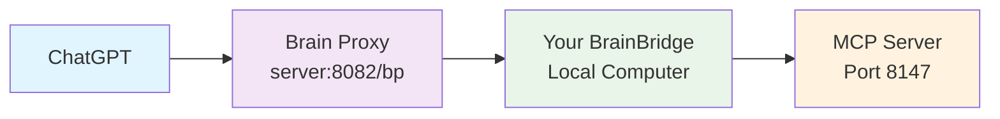
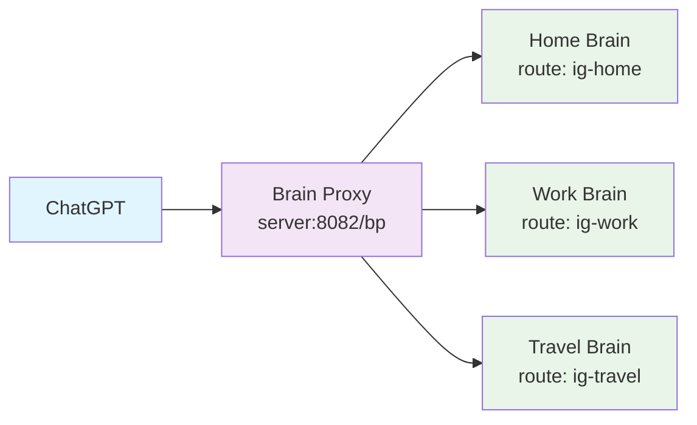
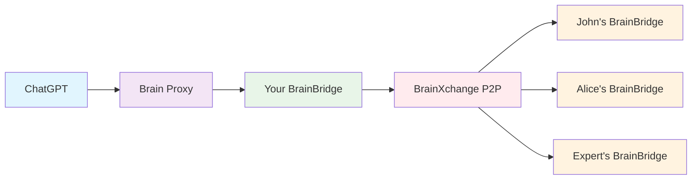
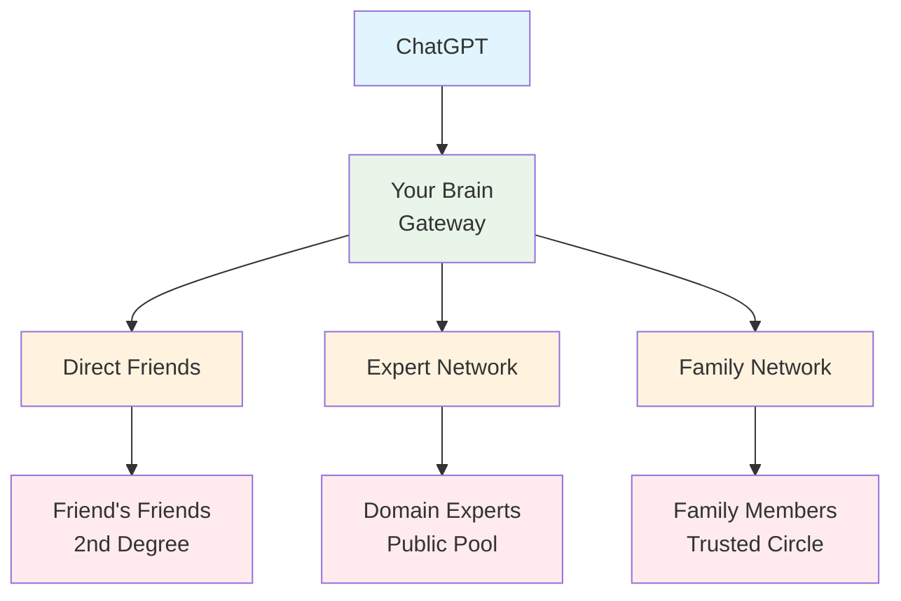

# Brain Proxy Evolution Roadmap

> **The comprehensive multi-phase plan for evolving Brain Proxy from single-brain GPT integration to collective intelligence networks**

## 🎯 Vision Statement

Transform Brain Proxy from a simple GPT-to-local-brain bridge into a sophisticated network that enables:
- **Personal AI Access** - Your GPT connects to your personal knowledge
- **Multi-Device Synchronization** - One GPT config for all your devices  
- **P2P Brain Networks** - Query your friends' expertise through trusted connections
- **Collective Intelligence** - Aggregate wisdom from your extended network

---

## 🏗️ Architecture Overview

### Current State (v0.1.0)
```
ChatGPT → Brain Proxy → Local BrainBridge → MCP Server
  (GPT)    (Cloud)        (Your Computer)     (Port 8147)
```
- **Status**: Experimental, working but needs polish
- **Scope**: Single brain, single device, basic GPT integration
- **Authentication**: Route + token in URL/header

### Target State (v0.2.0+)
```
ChatGPT → Brain Proxy → Your BrainBridge ← BrainXchange Network
  (GPT)    (Cloud)        (Your Gateway)      ↓
                             ↓              Friend's Brain
                        Your Local Brain    Expert's Brain
                                           Family Brain
```
- **Scope**: Multi-device, P2P network, collective intelligence
- **Authentication**: Hierarchical tokens, trust networks, permissions

---

## 📋 Phase Implementation Plan

## Phase 1: Foundation - Single Brain Integration (v0.1.1)

### 🎯 Goal
Production-ready Brain Proxy with simple setup and reliable GPT integration.

### 🔧 Key Features
- **`magi register` command** - One-command setup and credential generation
- **Robust connectivity** - Handle restarts, reconnections, offline scenarios
- **Production polish** - Remove experimental warnings, improve error messages
- **Direct port access** - Use `wss://server:8082/bp/connect` (works on DreamHost)

### 🏗️ Architecture


### 🔐 Authentication Flow
1. **Registration Phase**:
   ```bash
   $ magi register
   # Generates: route=ig-4f2a8b9d, secret=abc123...
   # User adds to .env file
   ```

2. **Connection Phase**:
   ```
   BrainBridge → wss://server:8082/bp/connect?route=ig-4f2a8b9d&token=abc123...
   Brain Proxy → Stores route mapping in memory
   ```

3. **Request Phase**:
   ```
   ChatGPT → POST /bp/rpc/_auto
   Headers: Authorization: Bearer ig-4f2a8b9d:abc123...
   Brain Proxy → Extracts route from composite key and validates
   ```

### 🛠️ Implementation Tasks
- [ ] Add `register` command to `bin/magi`
- [ ] Generate secure route (initials + 8 char hex) and secret (32 char hex)
- [ ] Test connection to Brain Proxy during registration
- [ ] Display GPT configuration instructions
- [ ] Update Brain Proxy connector with port 8082 default
- [ ] Improve error messages and reconnection logic
- [ ] Remove "EXPERIMENTAL" status from documentation
- [ ] Add comprehensive testing

### ✅ Success Criteria
- Users can setup GPT integration in < 2 minutes
- Connection survives restarts (both server and client)
- Clear error messages when offline
- GPT receives "limited capacity" responses when brain offline
- Documentation is production-ready

---

## Phase 2: Scale - Multi-Device Support (v0.1.2)

### 🎯 Goal
Support multiple devices per user with single GPT configuration.

### 🔧 Key Features
- **Multi-device registration** - Register multiple routes under one account
- **Shared authentication** - One token works for all your devices
- **Device discovery** - GPT can list and choose between your brains
- **Fallback routing** - If primary brain offline, try secondary

### 🏗️ Architecture


### 🔐 Enhanced Authentication
- **Account-based tokens** - `magi register --account ig` generates master token
- **Device-specific routes** - Each device gets `{account}-{device}` route
- **Route enumeration** - Brain Proxy can list routes for an account

### 🛠️ Registration Flow
```bash
# Initial setup
$ magi register --account ig
Generated account: ig
Master token: xyz789...
Generated route: ig-home (device: home)

# Additional devices  
$ magi register --account ig --device work
Using existing account: ig
Generated route: ig-work (device: work)

# List devices
$ magi register --list
Account: ig
Devices:
- ig-home (connected, last seen: 2 minutes ago)
- ig-work (offline, last seen: 1 hour ago)
```

### 🤖 GPT Integration Enhancements
New MCP tools for device management:
- `list_available_brains` - Show which of your brains are online
- `query_specific_brain` - Direct query to a specific device
- `query_any_brain` - Use first available brain (fallback logic)

Example GPT interaction:
```
User: "Check my work brain for that React project"
GPT → query_specific_brain(device="work", query="React project details")

User: "What do I know about Python?"  
GPT → query_any_brain(query="Python knowledge")
# Uses ig-home if available, falls back to ig-work
```

### 🛠️ Implementation Tasks
- [ ] Extend `magi register` with `--account` and `--device` flags
- [ ] Update Brain Proxy to handle account-based routing
- [ ] Add device enumeration and status endpoints
- [ ] Implement fallback logic in Brain Proxy
- [ ] Add multi-device MCP tools
- [ ] Update GPT action schema for device selection
- [ ] Create device management documentation

### ✅ Success Criteria
- Single GPT config works with multiple user devices
- Automatic fallback when primary brain offline
- Clear device status visibility
- Seamless user experience across devices

---

## Phase 3: Network - BrainXchange P2P Integration (v0.1.3)

### 🎯 Goal
Enable GPT to query your friends' brains through BrainXchange P2P network.

### 🔧 Key Features
- **Friend network queries** - "Ask John about React patterns"
- **Expertise discovery** - "Who in my network knows about ML?"
- **Controlled sharing** - Friends set permissions on what you can access
- **Privacy preservation** - Your brain acts as intermediary

### 🏗️ Architecture Choice: Relay Through Your Brain


**Why Relay (Not Direct GPT → Friend's Brain)**:
- ✅ **Security**: Friends never share Brain Proxy tokens
- ✅ **Privacy**: You control what questions are asked
- ✅ **Simplicity**: GPT only knows YOUR brain
- ✅ **Auditability**: You can log external queries
- ✅ **Permissions**: Friends control what they share with you

### 🔐 Multi-Layer Authentication
1. **GPT → Your Brain**: Brain Proxy token (unchanged)
2. **Your Brain → Friend's Brain**: BrainXchange P2P authentication
3. **Friend's Permissions**: What they allow you to query

### 🤖 New MCP Tools for P2P Queries
```typescript
// Query specific friend
query_friend_brain(friend: string, query: string, category?: string)

// Discover expertise in network
find_network_expertise(topic: string, max_friends?: number)

// Multi-friend aggregation
query_network_consensus(question: string, friends: string[])

// Friend network status
list_connected_friends()
```

### 💬 GPT Interaction Examples
```
User: "Ask my friend John about his React performance tips"
GPT → query_friend_brain(friend="john", query="React performance optimization")

User: "Who in my network knows about machine learning?"
GPT → find_network_expertise(topic="machine learning")
Response: "Alice (ML engineer), Prof. Smith (AI research), Dev-Bob (PyTorch expert)"

User: "What's the consensus from my dev friends about GraphQL?"
GPT → query_network_consensus(question="GraphQL pros and cons", friends=["john", "alice", "bob"])
```

### 🛠️ Implementation Architecture
```typescript
// Your BrainBridge handles routing
class NetworkQueryHandler {
  async queryFriend(friendId: string, query: string) {
    // 1. Check if friend is online via BrainXchange
    const friend = await this.brainXchange.findFriend(friendId);
    if (!friend.online) return "Friend's brain is offline";
    
    // 2. Check your permissions with that friend
    const permissions = await this.brainXchange.getPermissions(friendId);
    if (!permissions.allowQuery) return "Friend hasn't shared access with you";
    
    // 3. Send P2P query via BrainXchange
    const response = await this.brainXchange.sendQuery(friendId, {
      query,
      from: this.userId,
      permissions: permissions.allowedCategories
    });
    
    return response;
  }
}
```

### 🔒 Privacy & Permission Model
Friends can set granular permissions:
```json
{
  "user": "igor",
  "permissions": {
    "allowQuery": true,
    "allowedCategories": ["programming", "cooking", "travel"],
    "blockedCategories": ["personal", "financial"],
    "rateLimit": "10 queries/day",
    "allowAggregation": false
  }
}
```

### 🛠️ Implementation Tasks
- [ ] Extend BrainBridge with network query handlers
- [ ] Add P2P query MCP tools
- [ ] Implement friend discovery and status checking
- [ ] Create permission management system
- [ ] Add query logging and audit trails
- [ ] Update Brain Proxy to handle network queries
- [ ] Create friend network management CLI commands
- [ ] Documentation for P2P setup and permissions

### ✅ Success Criteria  
- Can query friend's brain through GPT interface
- Friends maintain full control over their data sharing
- Clear audit trail of external queries
- Graceful handling of offline friends
- Performance acceptable for network queries (< 5 seconds)

---

## Phase 4: Intelligence - Collective Networks (v0.2.0)

### 🎯 Goal
Transform individual brain queries into collective intelligence aggregation.

### 🔧 Key Features
- **Multi-hop queries** - Query friends of friends (with permission)
- **Expertise networks** - Find the best person to answer any question
- **Consensus building** - Aggregate opinions from multiple experts
- **Trust networks** - Weight responses based on relationship strength
- **Learning networks** - Your brain learns from network interactions

### 🏗️ Architecture: Distributed Intelligence Network


### 🧠 Collective Intelligence Features

**Network Query Routing**:
```bash
User: "What's the best way to learn Rust?"
GPT processes:
1. Query your personal knowledge first
2. Ask your programmer friends  
3. Query 2nd-degree connections who are Rust experts
4. Check public expert network for Rust specialists
5. Aggregate and rank responses by trust score
```

**Trust-Weighted Responses**:
```json
{
  "query": "Best practices for React performance",
  "responses": [
    {
      "source": "john", 
      "trust_score": 0.95,
      "expertise": "senior_react_dev",
      "response": "Use React.memo for expensive components..."
    },
    {
      "source": "alice->bob", 
      "trust_score": 0.7,
      "expertise": "fullstack_dev", 
      "response": "Implement virtual scrolling for large lists..."
    }
  ],
  "consensus": "Focus on memoization and virtual scrolling",
  "confidence": 0.87
}
```

### 🤖 Advanced MCP Tools
```typescript
// Multi-hop network query
query_expert_network(
  topic: string,
  max_hops: number = 2,
  min_expertise: number = 0.8,
  max_responses: number = 5
)

// Consensus with trust weighting
get_network_consensus(
  question: string,
  trust_threshold: number = 0.6,
  expertise_categories: string[]
)

// Network learning
learn_from_network(
  topic: string,
  save_to_memory: boolean = true,
  attribute_sources: boolean = true
)
```

### 🔒 Advanced Privacy Model
- **Hop permissions** - Allow/disallow friend-of-friend queries
- **Expertise advertising** - Opt-in to expert directory  
- **Attribution control** - Choose if your responses can be attributed
- **Learning consent** - Allow others to learn from your responses
- **Anonymous contributions** - Contribute without identity

### 🛠️ Implementation Tasks
- [ ] Design trust scoring algorithms
- [ ] Implement multi-hop query routing
- [ ] Create expert network discovery
- [ ] Add consensus aggregation algorithms
- [ ] Build reputation and trust systems
- [ ] Implement privacy-preserving aggregation
- [ ] Create network analytics and insights
- [ ] Add learning and knowledge synthesis

### ✅ Success Criteria
- Can find expertise anywhere in extended network (< 10 seconds)
- Trust-weighted responses more accurate than individual queries  
- Network effects improve answer quality over time
- Privacy preserved at all network levels
- Users feel comfortable contributing to collective intelligence

---

## 🔧 Technical Implementation Details

### Database Schema Evolution

**Phase 1 (v0.1.1)**: No persistent storage needed
- Brain Proxy uses in-memory Map for route storage
- BrainBridge stores credentials in `.env` file

**Phase 2 (v0.1.2)**: Simple device registry
```sql
CREATE TABLE user_accounts (
  account_id VARCHAR(32) PRIMARY KEY,
  master_token VARCHAR(64) NOT NULL,
  created_at TIMESTAMP DEFAULT CURRENT_TIMESTAMP
);

CREATE TABLE device_routes (
  route_id VARCHAR(64) PRIMARY KEY,
  account_id VARCHAR(32) REFERENCES user_accounts(account_id),
  device_name VARCHAR(32) NOT NULL,
  last_connected TIMESTAMP,
  status ENUM('online', 'offline')
);
```

**Phase 3 (v0.1.3)**: P2P permissions and relationships
```sql  
CREATE TABLE friendships (
  id UUID PRIMARY KEY,
  user_a VARCHAR(32) REFERENCES user_accounts(account_id),
  user_b VARCHAR(32) REFERENCES user_accounts(account_id),
  status ENUM('pending', 'active', 'blocked'),
  created_at TIMESTAMP DEFAULT CURRENT_TIMESTAMP
);

CREATE TABLE query_permissions (
  id UUID PRIMARY KEY,
  user_id VARCHAR(32) REFERENCES user_accounts(account_id),
  friend_id VARCHAR(32) REFERENCES user_accounts(account_id),
  allowed_categories TEXT[], -- JSON array
  rate_limit INTEGER DEFAULT 10,
  allow_aggregation BOOLEAN DEFAULT false
);
```

**Phase 4 (v0.2.0)**: Trust networks and expertise
```sql
CREATE TABLE trust_scores (
  id UUID PRIMARY KEY,
  evaluator VARCHAR(32) REFERENCES user_accounts(account_id),
  evaluated VARCHAR(32) REFERENCES user_accounts(account_id),
  category VARCHAR(64),
  score DECIMAL(3,2), -- 0.00 to 1.00
  updated_at TIMESTAMP DEFAULT CURRENT_TIMESTAMP
);

CREATE TABLE expertise_profiles (
  id UUID PRIMARY KEY,
  user_id VARCHAR(32) REFERENCES user_accounts(account_id),
  categories TEXT[], -- JSON array of expertise areas
  public_visibility BOOLEAN DEFAULT false,
  verified_expertise TEXT[] -- Verified by network
);
```

### API Evolution

**Phase 1 APIs**:
```typescript
// Brain Proxy HTTP endpoints
POST /bp/rpc/{route}               // Execute brain command
GET  /bp/health                    // Health check  
GET  /bp/openapi.json             // OpenAPI schema

// WebSocket connection
WSS  /bp/connect?route=X&token=Y  // Client connection
```

**Phase 2 APIs**:
```typescript
// Multi-device management
GET  /bp/account/{account}/devices     // List devices
POST /bp/account/{account}/devices     // Register device
GET  /bp/account/{account}/status      // Account status

// Enhanced RPC with device selection
POST /bp/rpc/{account}                 // Any available device
POST /bp/rpc/{account}/{device}        // Specific device
```

**Phase 3 APIs**:
```typescript
// Friend network queries
POST /bp/network/{account}/query       // Query friend network
GET  /bp/network/{account}/friends     // List connected friends
POST /bp/network/{account}/permissions // Set friend permissions

// P2P integration
POST /bp/p2p/discover                  // Find friends
POST /bp/p2p/invite                    // Send friend request
```

**Phase 4 APIs**:
```typescript
// Collective intelligence
POST /bp/collective/expert-query       // Query expert network
POST /bp/collective/consensus          // Get network consensus  
GET  /bp/collective/expertise          // Discover expertise
POST /bp/collective/contribute         // Contribute to network knowledge
```

### Security Model Evolution

**Phase 1**: Simple route + token validation
- Routes are ephemeral (in-memory only)
- Tokens are user-generated secrets
- No persistent authentication

**Phase 2**: Account-based authentication
- Master tokens for account management
- Device-specific routes under accounts
- Simple device enumeration

**Phase 3**: Multi-layer P2P security
- Brain Proxy authentication (Layer 1)
- BrainXchange P2P authentication (Layer 2)  
- Friend-specific permissions (Layer 3)

**Phase 4**: Trust-based network security
- Cryptographic trust chains
- Reputation-based access control
- Anonymous contribution verification
- Privacy-preserving aggregation

---

## 🚀 Migration Paths

### v0.1.0 → v0.1.1 Migration
**User Action Required**: None (automatic)
- Existing `.env` configurations continue to work
- `magi register` command generates same format credentials
- Brain Proxy remains backward compatible

### v0.1.1 → v0.1.2 Migration
**User Action Required**: Optional upgrade to multi-device
```bash
# Keep existing single-device setup (no changes needed)
# OR upgrade to multi-device
$ magi register --upgrade-to-account
Converting single route to account-based...
✅ Created account: ig
✅ Migrated route ig-4f2a8b9d → ig-home
✅ Updated .env configuration
```

### v0.1.2 → v0.1.3 Migration  
**User Action Required**: Friend network setup
```bash
# Enable P2P features (optional)
$ magi network enable
✅ BrainXchange P2P enabled
$ magi network invite john@example.com
✅ Friend request sent to john
```

### v0.1.3 → v0.2.0 Migration
**User Action Required**: Collective intelligence opt-in
```bash  
# Join expert networks (optional)
$ magi collective join --categories programming,cooking
✅ Opted into expert network for programming, cooking
✅ Trust scoring enabled
```

---

## 🧪 Testing Strategy

### Phase 1 Testing
- [ ] Unit tests for `magi register` command
- [ ] Integration tests for Brain Proxy connection
- [ ] E2E tests for GPT integration
- [ ] Restart resilience tests
- [ ] Offline/online transition tests

### Phase 2 Testing
- [ ] Multi-device registration tests
- [ ] Fallback routing tests  
- [ ] Device discovery tests
- [ ] Account management tests

### Phase 3 Testing
- [ ] P2P connection tests
- [ ] Friend permission tests
- [ ] Network query tests
- [ ] Privacy preservation tests

### Phase 4 Testing
- [ ] Trust scoring accuracy tests
- [ ] Consensus algorithm tests
- [ ] Multi-hop query performance tests
- [ ] Network security tests

---

## 📊 Success Metrics

### Phase 1 Metrics
- Time to first successful GPT query: < 2 minutes
- Connection uptime after restart: > 99%
- User setup completion rate: > 90%

### Phase 2 Metrics  
- Multi-device adoption rate: > 40% of users
- Average devices per user: 2.5
- Fallback success rate: > 95%

### Phase 3 Metrics
- Friend network queries per user/month: > 10
- Friend invitation acceptance rate: > 60%
- Privacy concern reports: < 1%

### Phase 4 Metrics
- Network query response time: < 5 seconds
- Answer quality improvement: > 30% vs individual queries
- Expert network participation: > 20% of users

---

## 🔮 Future Considerations (v0.3.0+)

### Potential Extensions
- **AI Agent Networks** - Brains that can initiate queries to each other
- **Blockchain Trust** - Decentralized trust scoring on blockchain
- **Enterprise Networks** - Company-wide brain sharing with admin controls
- **Public Knowledge Markets** - Paid expertise sharing networks
- **Multi-modal Brains** - Image, video, audio knowledge sharing
- **Specialized Networks** - Domain-specific expert networks (medical, legal, etc.)

### Research Areas
- **Privacy-Preserving ML** - Federated learning across brain networks
- **Semantic Knowledge Graphs** - Connected knowledge representation
- **Automatic Expertise Detection** - AI-driven expertise classification  
- **Cross-Cultural Networks** - Global knowledge sharing with cultural context
- **Real-time Collaboration** - Live brainstorming across brain networks

---

## 📝 Implementation Notes

### Development Principles
1. **Privacy First** - All network features must preserve user privacy
2. **Backward Compatibility** - Each phase must not break previous versions
3. **Graceful Degradation** - Features work even when network parts are offline
4. **User Control** - Users control all sharing and permissions
5. **Progressive Enhancement** - Each phase adds value without requiring upgrade

### Code Organization
```
services/brainproxy/
├── core/                 # Phase 1: Basic proxy functionality
├── devices/              # Phase 2: Multi-device support
├── network/              # Phase 3: P2P integration
├── collective/           # Phase 4: Collective intelligence
└── migrations/           # Version migration scripts
```

### Documentation Strategy
- Each phase gets dedicated setup guides
- Migration guides for each version transition
- Security documentation updated per phase
- API documentation versioned per phase

---

**This roadmap serves as the master plan for Brain Proxy evolution. Each phase builds on the previous, creating a progressively more powerful collective intelligence network while maintaining privacy, security, and user control.**

*Last Updated: v0.1.1 Implementation*  
*Next Review: After Phase 1 completion*