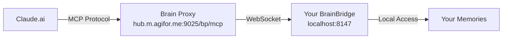

# Claude.ai MCP Connector Setup

> **Status**: Implementation guide for connecting Claude.ai to your magi system via MCP
> **Protocol**: Model Context Protocol (MCP) - Anthropic's standard for AI-tool communication
> **Endpoint**: `/bp/mcp` via Brain Proxy

## Overview

Claude.ai now supports remote MCP connectors, allowing you to connect your local magi knowledge base to Claude on the web. This guide covers two approaches:

1. **ngrok** - Quick local testing (temporary)
2. **Brain Proxy** - Production deployment via hub.m.agifor.me (permanent)

## Option 1: ngrok (Local Testing)

### Quick Setup
```bash
# Install ngrok if needed
brew install ngrok

# Make sure BrainBridge is running
magi start

# Expose your local MCP server
ngrok http 8147

# You'll see output like:
# Forwarding https://abc123.ngrok.io -> http://localhost:8147
```

### Configure Claude.ai
1. Go to [Claude.ai Settings > Connectors](https://claude.ai/settings/connectors)
2. Click "Add custom connector"
3. Enter MCP Server URL: `https://abc123.ngrok.io/mcp`
4. Click "Add"

### Pros & Cons
- ✅ **Quick setup** - Testing in minutes
- ✅ **No deployment needed** - Works from your local machine
- ❌ **Temporary URL** - Changes each session
- ❌ **Requires local magi running** - Computer must stay on
- ❌ **Security concerns** - Exposing local services

## Option 2: Brain Proxy (Production)

### How It Works


### Prerequisites
- ✅ magi registered to Brain Proxy (done)
- ✅ BrainBridge running locally (`magi start`)
- ✅ Brain Proxy MCP endpoint deployed

### Configure Claude.ai
1. Go to [Claude.ai Settings > Connectors](https://claude.ai/settings/connectors)
2. Click "Add custom connector"
3. Enter MCP Server URL: `http://hub.m.agifor.me:9025/bp/mcp`
4. When prompted for authentication:
   - Select "Bearer token"
   - Enter your composite key: `ig-501097c1:c86ae73c8a8292872e9bdbe09ba5937d`
5. Click "Add"

### Authentication Flow
The Brain Proxy uses composite key authentication:
- **Format**: `route:secret`
- **Example**: `ig-501097c1:c86ae73c8a8292872e9bdbe09ba5937d`
- **Components**:
  - `ig-501097c1` - Your unique route identifier
  - `c86ae73c8a8292872e9bdbe09ba5937d` - Your secret key

### Available MCP Tools

Once connected, Claude.ai will have access to these magi tools:

1. **search_memories** - Search your knowledge base
2. **add_memory** - Add new knowledge entries
3. **ai_query_memories** - AI-powered memory synthesis
4. **ai_save_memory** - AI-categorized memory storage
5. **ai_status** - Check AI system status
6. **get_organization_patterns** - View memory organization
7. **toggle_trace_mode** - Enable detailed logging
8. **brainxchange_command** - P2P brain sharing

### Testing the Connection

In Claude.ai, try these commands:
```
"Search my memories for my favorite beer"
"What do I know about Python?"
"Save this to my memories: [some information]"
```

## Troubleshooting

### Connection Failed
- Verify BrainBridge is running: `magi status`
- Check Brain Proxy connection in logs: `magi logs`
- Ensure composite key is correct (no spaces)

### Authentication Error
- Regenerate credentials: `magi register`
- Update both `.env` and Claude.ai settings
- Restart BrainBridge: `magi restart`

### SSL/TLS Issues
- Current limitation: Using `http://` not `https://`
- Phase 2 will add full SSL support (see PHASE_2_HOSTINGER_MIGRATION.md)

### No Tools Available
- Check MCP endpoint: `curl http://hub.m.agifor.me:9025/bp/health`
- Verify tools list: `curl -X POST http://localhost:8147/mcp -d '{"method":"tools/list"}'`

## Security Considerations

### Current Setup (Phase 1)
- ⚠️ **Unencrypted transport** - Using `ws://` and `http://`
- ✅ **Authentication required** - Composite key validation
- ✅ **Route isolation** - Each user has unique route
- ✅ **No data persistence** - Brain Proxy doesn't store data

### Future Improvements (Phase 2)
- 🔒 **Full SSL/TLS** - Migration to Hostinger VPS
- 🔒 **Encrypted WebSocket** - `wss://` connections
- 🔒 **Certificate validation** - Let's Encrypt integration

## Comparison: ChatGPT vs Claude.ai

| Feature | ChatGPT | Claude.ai |
|---------|---------|-----------|
| **Protocol** | OpenAPI/REST | MCP (Model Context Protocol) |
| **Endpoint** | `/bp/rpc/_auto` | `/bp/mcp` |
| **Auth Method** | Bearer token | Bearer token |
| **Key Format** | `route:secret` | `route:secret` |
| **Setup Location** | Custom GPT Builder | Settings > Connectors |
| **Spec Format** | OpenAPI JSON | MCP JSON-RPC |

## Next Steps

1. **For Testing**: Use ngrok option to verify everything works
2. **For Production**: Wait for Brain Proxy MCP deployment
3. **For Development**: See developer notes in `/services/braincloud/brainproxy/`

---

*Last Updated: Implementation for Phase 1*  
*Next: Full SSL support in Phase 2 (Hostinger migration)*