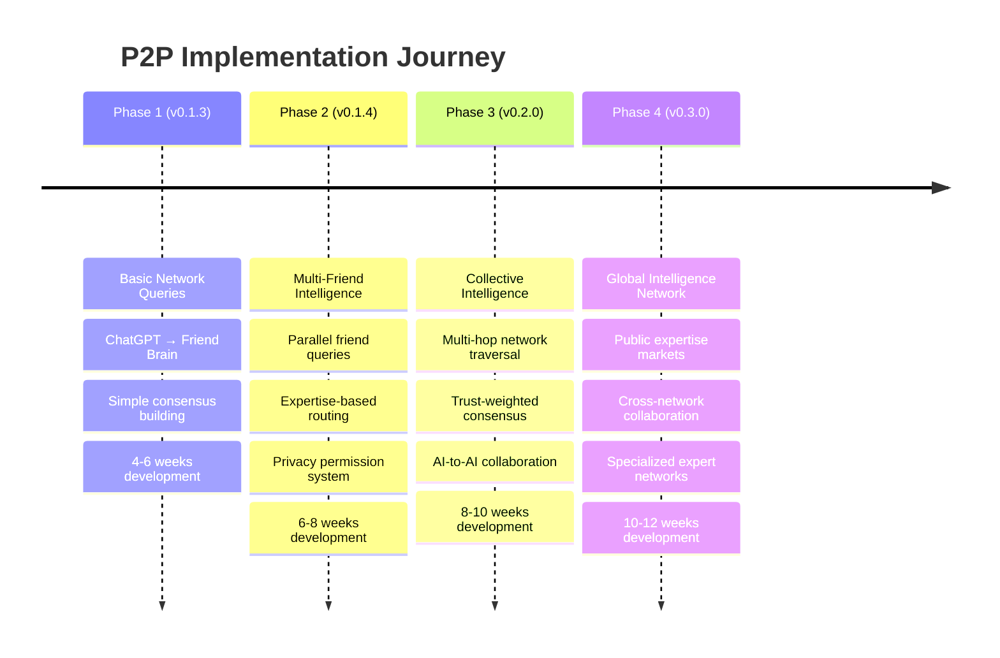

# 🗺️ P2P Collective Intelligence Implementation Roadmap

> **From concept to reality**: Step-by-step implementation plan to build the world's first collective intelligence network accessible through ChatGPT.

---

## 🎯 **Implementation Overview**

### **The Journey: 4 Phases to Collective Intelligence**



---

## 🚀 **Phase 1: Basic Network Queries (v0.1.3)**

### **🎯 Goal**: Enable ChatGPT to query individual friends through P2P network

**Timeline**: 4-6 weeks  
**Complexity**: Moderate (builds on existing BrainXchange foundation)

### **Core Features**

#### **1. New MCP Tools for ChatGPT**
```typescript
// Phase 1 MCP tools to implement
interface Phase1MCPTools {
  query_friend_brain(friend: string, query: string, category?: string): Promise<FriendResponse>
  list_connected_friends(): Promise<FriendStatus[]>
  find_friend_expertise(friend: string, topic: string): Promise<ExpertiseLevel>
}
```

#### **2. Enhanced Brain Proxy P2P Routing**
```javascript
// Brain Proxy enhancement for P2P queries
class BrainProxyP2PHandler {
  async handleFriendQuery(req, res) {
    const { friend, query, category } = req.body
    
    // Route query through BrainXchange P2P network
    const response = await this.routeToFriend(friend, query, category)
    
    return response
  }
}
```

#### **3. BrainBridge Network Integration**
```typescript
// Enhanced BrainBridge with basic network queries
class BasicNetworkQueryHandler {
  async queryFriend(friendId: string, query: string): Promise<FriendResponse> {
    // 1. Check friend availability
    // 2. Send P2P query
    // 3. Return structured response
  }
}
```

### **Implementation Tasks**

#### **Week 1-2: Foundation Setup**
- [ ] **Create new MCP tools** in BrainBridge server
  - `query_friend_brain` tool implementation
  - `list_connected_friends` tool implementation  
  - `find_friend_expertise` basic implementation
- [ ] **Extend Brain Proxy** with P2P routing endpoints
  - New `/bp/p2p/query` endpoint
  - Friend discovery routing
  - Basic error handling

#### **Week 3-4: Core P2P Integration**
- [ ] **Enhance BrainXchange service** for network queries
  - Structured query/response protocol
  - Friend availability checking
  - Basic permission validation
- [ ] **Implement BrainBridge network handler**
  - Query routing logic
  - Response formatting for ChatGPT
  - Timeout and error handling

#### **Week 5-6: Testing & Polish**
- [ ] **End-to-end testing**
  - ChatGPT → Brain Proxy → BrainBridge → BrainXchange flow
  - Multiple friend scenarios
  - Error condition handling
- [ ] **Documentation updates**
  - Updated MCP tool documentation
  - P2P setup guide for users
  - Troubleshooting guide

### **Success Criteria**
- ✅ ChatGPT can query individual friends: `"Ask John about React patterns"`
- ✅ Real-time friend availability status
- ✅ Basic error handling when friends are offline
- ✅ Structured responses formatted for ChatGPT consumption

### **Example User Experience**
```
You: "Ask John about his React best practices"
ChatGPT: "Querying John's brain...
John: 'I always use custom hooks for state logic and memo for expensive components. Here's my pattern...'
Would you like me to ask him about specific React topics?"
```

---

## 🧠 **Phase 2: Multi-Friend Intelligence (v0.1.4)**

### **🎯 Goal**: Enable ChatGPT to query multiple friends simultaneously and build consensus

**Timeline**: 6-8 weeks  
**Complexity**: High (parallel processing, consensus algorithms)

### **Core Features**

#### **1. Advanced MCP Tools**
```typescript
// Phase 2 advanced MCP tools
interface Phase2MCPTools extends Phase1MCPTools {
  query_network_consensus(question: string, friends: string[]): Promise<ConsensusResponse>
  find_network_expertise(topic: string, max_friends?: number): Promise<ExpertiseMap>
  get_network_status(): Promise<NetworkHealth>
}
```

#### **2. Parallel Query Engine**
```typescript
class ParallelQueryEngine {
  async queryMultipleFriends(query: string, friends: string[]): Promise<FriendResponse[]> {
    // Execute queries in parallel with timeout handling
    const promises = friends.map(friend => this.queryFriend(friend, query))
    const results = await Promise.allSettled(promises)
    return this.processResults(results)
  }
}
```

#### **3. Consensus Building AI**
```typescript
class ConsensusAnalyzer {
  async analyzeResponses(question: string, responses: FriendResponse[]): Promise<Consensus> {
    // Use AI to synthesize multiple perspectives into consensus
    return await this.buildConsensus(question, responses)
  }
}
```

#### **4. Expertise Discovery Engine**
```typescript
class ExpertiseDiscoveryEngine {
  async findTopicExperts(topic: string): Promise<ExpertiseMap> {
    // Analyze friend networks for topic expertise
    // Return ranked list of experts with confidence scores
  }
}
```

### **Implementation Tasks**

#### **Week 1-2: Parallel Processing Foundation**
- [ ] **Build parallel query infrastructure**
  - Concurrent P2P query execution
  - Timeout and error handling for parallel requests
  - Result aggregation and formatting
- [ ] **Implement expertise discovery**
  - Friend expertise profiling system
  - Topic matching algorithms
  - Confidence scoring for expertise levels

#### **Week 3-4: Consensus Building**
- [ ] **AI-powered consensus analysis**
  - Response similarity clustering
  - Majority/minority opinion detection
  - Confidence-weighted consensus building
- [ ] **Enhanced response synthesis**
  - Multiple perspective aggregation
  - Conflict resolution in opposing views
  - Source attribution and credibility

#### **Week 5-6: Privacy & Permissions**
- [ ] **Granular permission system**
  - Category-based sharing controls
  - Rate limiting per friend
  - Privacy preference enforcement
- [ ] **Audit and logging system**
  - Query logging for transparency
  - Friend interaction analytics
  - Privacy compliance tracking

#### **Week 7-8: Integration & Testing**
- [ ] **Full ChatGPT integration**
  - Multi-friend query UI in ChatGPT
  - Real-time progress indicators
  - Interactive consensus exploration
- [ ] **Comprehensive testing**
  - Load testing with multiple friends
  - Edge case handling
  - Privacy validation

### **Success Criteria**
- ✅ ChatGPT can query 3-5 friends simultaneously
- ✅ Intelligent consensus building from multiple responses
- ✅ Expertise-based friend selection for topics
- ✅ Granular privacy controls working
- ✅ Sub-5 second response times for multi-friend queries

### **Example User Experience**
```
You: "What's the consensus from my dev friends about microservices?"
ChatGPT: "Consulting your developer network...

📊 Queried 4 senior developers:
• John (5 years microservices): "Great for large teams, complex for small ones"
• Alice (Architect): "Start monolithic, split when team grows >8 people"  
• Bob (DevOps): "Infrastructure overhead is real - need strong ops team"
• Maria (CTO): "Depends on team maturity and business complexity"

💭 Consensus (75% agreement): Start monolithic, evolve to microservices based on team size and complexity. Key factor: operational capability.

🤔 Minority view (25%): Bob suggests considering serverless instead for small teams.

Want me to ask follow-up questions about your specific context?"
```

---

## 🌐 **Phase 3: Collective Intelligence (v0.2.0)**

### **🎯 Goal**: True collective intelligence with multi-hop queries, trust networks, and AI-to-AI collaboration

**Timeline**: 8-10 weeks  
**Complexity**: Very High (distributed systems, advanced AI, complex social dynamics)

### **Core Features**

#### **1. Multi-Hop Network Traversal**
```typescript
class MultiHopQueryEngine {
  async queryFriendOfFriends(query: string, maxHops: number, trustThreshold: number): Promise<MultiHopResult> {
    // Traverse friend networks with permission and trust validation
    // Find expertise 2-3 degrees away from user
    // Aggregate responses with trust weighting
  }
}
```

#### **2. Trust-Weighted Consensus**
```typescript
interface TrustNetwork {
  calculateTrustScore(userA: string, userB: string): number
  buildTrustGraph(user: string, maxDepth: number): TrustGraph
  weightResponsesByTrust(responses: Response[], trustGraph: TrustGraph): WeightedConsensus
}
```

#### **3. AI-to-AI Collaboration**
```typescript
class CollectiveIntelligenceEngine {
  async collaborateAIs(query: string, friendAIs: AIAgent[]): Promise<CollectiveResponse> {
    // Enable AI agents to reason together
    // Share context and collaborate on complex problems
    // Produce collective insights beyond individual capability
  }
}
```

#### **4. Dynamic Expertise Networks**
```typescript
class ExpertiseNetworkManager {
  async discoverExpertNetworks(topic: string): Promise<ExpertNetwork[]>
  async joinSpecializedNetwork(network: string, user: string): Promise<NetworkMembership>
  async contributeToNetwork(network: string, expertise: ExpertiseContribution): Promise<void>
}
```

### **Implementation Tasks**

#### **Week 1-3: Multi-Hop Foundation**
- [ ] **Multi-hop query infrastructure**
  - Friend-of-friend discovery algorithms
  - Permission propagation across network hops
  - Trust score calculation and validation
- [ ] **Trust network mapping**
  - Social graph analysis and trust computation
  - Dynamic trust updates based on interactions
  - Trust-weighted response algorithms

#### **Week 4-6: AI-to-AI Collaboration**
- [ ] **Collective reasoning engine**
  - AI agent communication protocols
  - Shared context and knowledge synthesis
  - Collaborative problem-solving algorithms
- [ ] **Advanced consensus building**
  - Multi-dimensional consensus analysis
  - Confidence intervals and uncertainty quantification
  - Expertise-weighted opinion aggregation

#### **Week 7-8: Specialized Networks**
- [ ] **Expertise network discovery**
  - Topic-based network formation
  - Automated expert recruitment
  - Network quality and reputation systems
- [ ] **Cross-network collaboration**
  - Inter-network knowledge sharing
  - Expertise bridging between domains
  - Global knowledge graph construction

#### **Week 9-10: Advanced Features & Polish**
- [ ] **Real-time collaboration features**
  - Live brainstorming sessions across networks
  - Collaborative document creation
  - Real-time expert consultation
- [ ] **Advanced analytics and insights**
  - Network health monitoring
  - Expertise flow analysis
  - Predictive networking recommendations

### **Success Criteria**
- ✅ Multi-hop queries (friends of friends) working
- ✅ Trust-weighted consensus with confidence scores
- ✅ AI agents collaborating to solve complex problems
- ✅ Dynamic expertise network formation
- ✅ Cross-network knowledge sharing
- ✅ Real-time collaborative problem solving

### **Example User Experience**
```
You: "I need to solve a complex distributed systems problem - find the best experts globally"
ChatGPT: "🌍 Scanning extended networks for distributed systems expertise...

🔍 Multi-hop discovery found:
• Dr. Smith (friend of Alice) - Distributed consensus algorithms expert
• Maria Santos (friend of Bob) - Netflix distributed systems architect  
• Chen Wei (friend of John) - Kubernetes networking specialist

🤝 Collective consultation in progress...
[3 AI agents collaborating in real-time]

Dr. Smith's AI: "Based on CAP theorem, your consistency requirements suggest..."
Maria's AI: "Netflix solved similar with eventual consistency patterns..."
Chen's AI: "Kubernetes service mesh could address networking concerns..."

💡 Collective Intelligence Synthesis:
The three expert AIs have collaborated on your problem and suggest a hybrid approach combining eventual consistency (Netflix pattern) with selective strong consistency (Smith's algorithm) implemented via service mesh (Chen's expertise).

Confidence: 94% (very high agreement between expert systems)
Next steps: Would you like to initiate a live collaboration session with these experts?"
```

---

## 🌟 **Phase 4: Global Intelligence Network (v0.3.0)**

### **🎯 Goal**: Global-scale expertise networks, knowledge markets, and cross-platform intelligence

**Timeline**: 10-12 weeks  
**Complexity**: Extreme (global infrastructure, economic models, social dynamics)

### **Core Features**

#### **1. Global Expertise Markets**
```typescript
interface ExpertiseMarket {
  listExpertise(topic: string, price_range: [number, number]): ExpertiseListing[]
  purchaseExpertise(expert: string, query: string, payment: Payment): ExpertiseResponse
  contributeExpertise(topics: string[], pricing: PricingModel): ExpertiseProfile
}
```

#### **2. Cross-Platform Intelligence**
```typescript
class CrossPlatformIntelligence {
  async bridgeToSlack(workspace: string): Promise<SlackIntegration>
  async bridgeToDiscord(server: string): Promise<DiscordIntegration>  
  async bridgeToLinkedIn(network: string): Promise<LinkedInIntegration>
  async bridgeToGitHub(organizations: string[]): Promise<GitHubIntegration>
}
```

#### **3. Specialized Expert Networks**
```typescript
interface SpecializedNetworks {
  medical: MedicalExpertNetwork
  legal: LegalExpertNetwork  
  financial: FinancialExpertNetwork
  academic: AcademicExpertNetwork
  creative: CreativeExpertNetwork
}
```

### **Implementation Tasks**

#### **Week 1-4: Global Infrastructure**
- [ ] **Global P2P infrastructure**
  - Multi-region deployment
  - Load balancing and scaling
  - Global expertise discovery
- [ ] **Economic model implementation**
  - Expertise pricing and payments
  - Reputation-based pricing
  - Value capture and distribution

#### **Week 5-8: Cross-Platform Integration**
- [ ] **Platform bridges**
  - Slack/Discord bot integration
  - LinkedIn professional network access
  - GitHub collaboration integration
- [ ] **Universal expertise protocol**
  - Cross-platform expertise sharing
  - Unified authentication and reputation
  - Global expertise search and discovery

#### **Week 9-12: Specialized Networks & Polish**
- [ ] **Professional networks**
  - Medical consultation networks
  - Legal advice networks
  - Financial expertise networks
- [ ] **Enterprise features**
  - Corporate expertise networks
  - Professional service integration
  - Compliance and security features

### **Success Criteria**
- ✅ Global expertise markets functioning
- ✅ Cross-platform intelligence bridges active
- ✅ Specialized professional networks operational
- ✅ Economic models for expertise sharing working
- ✅ Enterprise-grade security and compliance

---

## 📊 **Development Resources & Timeline**

### **Team Requirements**

#### **Core Development Team (Phase 1-2)**
- **1 Senior Full-Stack Developer** - BrainBridge and Brain Proxy enhancements
- **1 P2P Systems Engineer** - BrainXchange protocol improvements
- **1 AI/ML Engineer** - Consensus algorithms and expertise matching
- **1 Frontend Developer** - ChatGPT integration and UI

#### **Expanded Team (Phase 3-4)**
- **+1 Distributed Systems Engineer** - Multi-hop and scaling
- **+1 Security Engineer** - Trust networks and privacy
- **+1 Data Scientist** - Network analytics and optimization
- **+1 Product Designer** - User experience optimization

### **Technology Stack**

#### **Backend Infrastructure**
- **Node.js/TypeScript** - Core services
- **WebSocket** - Real-time P2P communication
- **Redis** - Caching and session management
- **PostgreSQL** - Persistent data and relationships
- **Docker/Kubernetes** - Containerization and orchestration

#### **AI/ML Components**
- **OpenAI API** - Consensus analysis and synthesis
- **Vector Databases** - Expertise matching and search
- **LangChain** - AI agent orchestration
- **Custom ML Models** - Trust scoring and reputation

#### **Frontend/Integration**
- **React/TypeScript** - Web dashboard (optional)
- **MCP Protocol** - Claude Code integration
- **OpenAPI** - ChatGPT Custom GPT integration
- **WebSocket Client** - Real-time updates

### **Infrastructure Requirements**

#### **Phase 1-2: Basic Infrastructure**
- **Development**: 2-3 cloud servers
- **Staging**: Mirror of production
- **Production**: 3-5 servers with load balancing

#### **Phase 3-4: Scaled Infrastructure**
- **Multi-region deployment** - 3+ geographic regions
- **CDN and edge caching** - Global performance
- **Database clustering** - High availability
- **Auto-scaling groups** - Dynamic load handling

---

## 🎯 **Risk Mitigation & Contingency Plans**

### **Technical Risks**

#### **P2P Network Reliability**
- **Risk**: Network partitions and friend availability
- **Mitigation**: Robust offline handling, cached responses, graceful degradation

#### **Consensus Algorithm Complexity**
- **Risk**: Poor consensus quality, conflicting opinions
- **Mitigation**: Multiple consensus algorithms, confidence scoring, user override

#### **Performance at Scale**
- **Risk**: Slow responses with large networks
- **Mitigation**: Intelligent friend selection, parallel processing, caching

### **Social/Privacy Risks**

#### **Privacy Concerns**
- **Risk**: Users uncomfortable with knowledge sharing
- **Mitigation**: Granular controls, opt-in features, transparent audit trails

#### **Network Effect Bootstrap**
- **Risk**: Low adoption without network effects
- **Mitigation**: Gradual rollout, incentive systems, demonstration value

#### **Expertise Quality Control**
- **Risk**: Poor advice from network
- **Mitigation**: Reputation systems, expertise validation, user feedback

---

## 🏁 **Success Metrics & KPIs**

### **Phase 1 Metrics**
- **Technical**: Query success rate >95%, response time <3 seconds
- **User**: >100 active P2P connections, >1000 friend queries/month
- **Quality**: User satisfaction >4.5/5 for P2P responses

### **Phase 2 Metrics**  
- **Technical**: Multi-friend consensus quality >80% accuracy
- **User**: >500 active networks, >10,000 consensus queries/month
- **Quality**: Consensus rated more helpful than individual responses

### **Phase 3 Metrics**
- **Technical**: Multi-hop queries <5 seconds, trust calculation accuracy >90%
- **User**: >1000 active networks, expertise discovery success >70%
- **Quality**: AI-to-AI collaboration produces superior insights

### **Phase 4 Metrics**
- **Technical**: Global network latency <2 seconds, 99.9% uptime
- **User**: >10,000 active networks, cross-platform integration usage >50%
- **Quality**: Professional network ROI demonstrates clear value

---

## 🎉 **The Vision Realized**

By the end of this implementation roadmap, we will have created the **world's first collective intelligence network** accessible through natural conversation with ChatGPT.

Users will experience AI that's not just smart, but **connected to human wisdom at unprecedented scale** - turning every ChatGPT conversation into a potential consultation with the world's expertise.

This is more than just a feature - it's **the future of human-AI collaboration**.

---

**Ready to build the collective intelligence revolution?** 🚀

*Next steps: Begin Phase 1 implementation with the development team!*