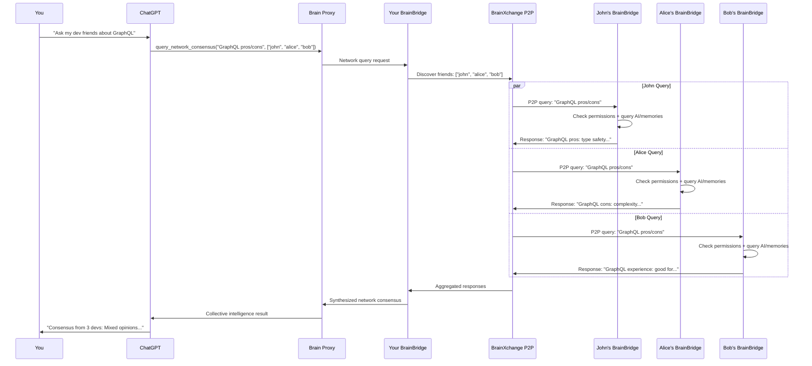

# 🏗️ P2P Collective Intelligence Architecture

> **Deep dive into the technical architecture that enables ChatGPT to orchestrate collective intelligence across P2P networks**

---

## 🎯 **Architecture Overview**

The P2P Collective Intelligence system transforms ChatGPT from a single AI into a **network orchestrator** that can query, aggregate, and synthesize knowledge from your entire friend network in real-time.

### **Core Architectural Principles**

1. **🔒 Privacy-First Relay** - Your brain acts as the trust boundary
2. **⚡ Real-Time Aggregation** - Sub-5 second multi-friend queries
3. **🎯 Expertise Routing** - Smart friend selection based on knowledge domains
4. **🛡️ Permission Enforcement** - Friends control exactly what they share
5. **📊 Consensus Building** - Aggregate multiple perspectives intelligently

---

## 🌊 **Data Flow Architecture**

### **The Complete P2P Query Flow**



---

## 🧩 **Component Architecture**

### **1. ChatGPT Integration Layer**

**New MCP Tools for Collective Intelligence:**

```typescript
interface NetworkMCPTools {
  // Core P2P query tools
  query_friend_brain(friend: string, query: string, category?: string): Promise<FriendResponse>
  query_network_consensus(question: string, friends: string[]): Promise<ConsensusResponse>
  find_network_expertise(topic: string, max_friends?: number): Promise<ExpertiseMap>
  list_connected_friends(): Promise<FriendStatus[]>
  
  // Advanced network operations
  query_multi_hop(question: string, max_hops: number): Promise<MultiHopResponse>
  aggregate_expert_opinions(topic: string, confidence_threshold: number): Promise<ExpertConsensus>
  discover_friend_networks(friend: string): Promise<ExtendedNetwork>
}
```

**Response Types:**
```typescript
interface FriendResponse {
  friend: string
  response: string
  confidence: number
  expertise_level: number
  response_time: number
  permissions_applied: string[]
}

interface ConsensusResponse {
  question: string
  responses: FriendResponse[]
  consensus: string
  confidence: number
  agreement_level: number
  minority_opinions: string[]
}

interface ExpertiseMap {
  topic: string
  experts: Array<{
    friend: string
    expertise_level: number
    specializations: string[]
    availability: 'online' | 'offline' | 'busy'
    last_active: string
  }>
}
```

### **2. Brain Proxy Enhancement**

**New P2P Endpoints:**

```javascript
// Brain Proxy routes for P2P
class BrainProxyP2PHandler {
  
  // Route network queries to appropriate friends
  async handleNetworkQuery(req, res) {
    const { question, friends, options } = req.body
    
    // 1. Validate permissions
    const permissions = await this.validateP2PPermissions(friends)
    
    // 2. Route to friend networks
    const responses = await this.queryFriendNetworks(question, friends, permissions)
    
    // 3. Aggregate and synthesize
    const consensus = await this.synthesizeConsensus(responses, options)
    
    return consensus
  }
  
  // Discover expertise in network
  async handleExpertiseDiscovery(req, res) {
    const { topic, max_friends } = req.body
    
    // Query friend expertise profiles
    const expertiseMap = await this.discoverNetworkExpertise(topic, max_friends)
    
    return expertiseMap
  }
  
  // Handle multi-hop network traversal
  async handleMultiHopQuery(req, res) {
    const { question, max_hops, trust_threshold } = req.body
    
    // Traverse friend networks with permission checking
    const multiHopResults = await this.traverseFriendNetworks(question, max_hops, trust_threshold)
    
    return multiHopResults
  }
}
```

### **3. BrainBridge Network Query Handler**

**Enhanced BrainBridge with Network Intelligence:**

```typescript
class NetworkQueryHandler {
  constructor(
    private brainXchange: BrainXchangeService,
    private memoryService: MemoryService,
    private aiProvider: AIProvider
  ) {}
  
  async queryFriend(friendId: string, query: string, category?: string): Promise<FriendResponse> {
    // 1. Check friend online status
    const friend = await this.brainXchange.findFriend(friendId)
    if (!friend.online) {
      return { friend: friendId, response: "Friend's brain is offline", confidence: 0 }
    }
    
    // 2. Validate permissions
    const permissions = await this.brainXchange.getPermissions(friendId)
    if (!this.canQuery(permissions, category)) {
      return { friend: friendId, response: "Access denied for this category", confidence: 0 }
    }
    
    // 3. Send P2P query with context
    const queryContext = {
      query,
      category,
      from: this.userId,
      timestamp: Date.now(),
      permissions: permissions.allowedCategories
    }
    
    const response = await this.brainXchange.sendQuery(friendId, queryContext)
    
    // 4. Log interaction for audit trail
    await this.logNetworkQuery(friendId, query, response)
    
    return response
  }
  
  async findNetworkExpertise(topic: string, maxFriends: number = 5): Promise<ExpertiseMap> {
    // 1. Get all connected friends
    const friends = await this.brainXchange.getConnectedFriends()
    
    // 2. Query expertise levels for topic
    const expertisePromises = friends.map(async (friend) => {
      const expertise = await this.queryFriendExpertise(friend.id, topic)
      return { friend: friend.id, ...expertise }
    })
    
    const expertiseResults = await Promise.all(expertisePromises)
    
    // 3. Rank by expertise level and availability
    const rankedExperts = expertiseResults
      .filter(e => e.expertise_level > 0.3) // Minimum expertise threshold
      .sort((a, b) => b.expertise_level - a.expertise_level)
      .slice(0, maxFriends)
    
    return {
      topic,
      experts: rankedExperts
    }
  }
  
  async queryNetworkConsensus(question: string, friends: string[]): Promise<ConsensusResponse> {
    // 1. Query all friends in parallel
    const queryPromises = friends.map(friendId => 
      this.queryFriend(friendId, question)
    )
    
    const responses = await Promise.allSettled(queryPromises)
    const validResponses = responses
      .filter(r => r.status === 'fulfilled')
      .map(r => r.value)
      .filter(r => r.confidence > 0)
    
    // 2. Analyze consensus using AI
    const consensus = await this.analyzeConsensus(question, validResponses)
    
    return {
      question,
      responses: validResponses,
      consensus: consensus.summary,
      confidence: consensus.confidence,
      agreement_level: consensus.agreement,
      minority_opinions: consensus.minorities
    }
  }
  
  private async analyzeConsensus(question: string, responses: FriendResponse[]): Promise<ConsensusAnalysis> {
    const analysisPrompt = `
    Analyze these responses to "${question}" from my network:
    
    ${responses.map(r => `${r.friend}: ${r.response} (confidence: ${r.confidence})`).join('\n')}
    
    Provide:
    1. Summary consensus (2-3 sentences)
    2. Confidence level (0-1)
    3. Agreement level (0-1) 
    4. Minority opinions that differ from consensus
    `
    
    const analysis = await this.aiProvider.query(analysisPrompt)
    return this.parseConsensusAnalysis(analysis)
  }
}
```

### **4. BrainXchange P2P Network Enhancement**

**Enhanced P2P Protocol for Network Queries:**

```javascript
// Enhanced BrainXchange for collective intelligence
class BrainXchangeNetworkService extends BrainXchangeService {
  
  async sendNetworkQuery(friendId, queryContext) {
    const message = {
      type: 'network_query',
      to: friendId,
      query: queryContext.query,
      category: queryContext.category,
      from: queryContext.from,
      timestamp: queryContext.timestamp,
      queryId: this.generateQueryId()
    }
    
    return this.sendP2PMessage(message)
  }
  
  async handleNetworkQuery(message) {
    const { query, category, from, queryId } = message
    
    // 1. Check permissions for this friend and category
    const permissions = await this.getPermissionsForFriend(from)
    if (!this.canQueryCategory(permissions, category)) {
      return this.sendQueryResponse(queryId, "Access denied", 0)
    }
    
    // 2. Apply rate limiting
    if (!await this.checkRateLimit(from, permissions.rateLimit)) {
      return this.sendQueryResponse(queryId, "Rate limit exceeded", 0)
    }
    
    // 3. Process query through local AI + memories
    const response = await this.processLocalQuery(query, category, permissions)
    
    // 4. Send response back
    return this.sendQueryResponse(queryId, response.text, response.confidence)
  }
  
  async processLocalQuery(query, category, permissions) {
    // Use local BrainBridge to process query
    const relevantMemories = await this.memoryService.search(query, {
      categories: permissions.allowedCategories,
      limit: 10
    })
    
    const aiResponse = await this.aiProvider.synthesize(query, relevantMemories, {
      privacy_mode: true,
      category_filter: permissions.allowedCategories
    })
    
    return {
      text: aiResponse.response,
      confidence: aiResponse.confidence,
      sources: aiResponse.sources.length
    }
  }
}
```

---

## 🔒 **Privacy & Security Architecture**

### **Multi-Layer Permission System**

```typescript
interface FriendPermissions {
  friend_id: string
  permissions: {
    // Basic access control
    allow_query: boolean
    allow_aggregation: boolean
    
    // Category-based permissions
    allowed_categories: string[]
    blocked_categories: string[]
    
    // Rate limiting
    queries_per_day: number
    queries_per_hour: number
    
    // Context sharing
    share_sources: boolean
    share_confidence: boolean
    
    // Response modes
    response_mode: 'ai_generated' | 'memory_search' | 'direct_answer'
    
    // Time-based restrictions
    active_hours: { start: string, end: string }
    timezone: string
    
    // Trust levels
    trust_level: 'public' | 'friend' | 'close_friend' | 'family'
  }
  
  // Audit settings
  audit: {
    log_queries: boolean
    notify_on_query: boolean
    share_query_stats: boolean
  }
}
```

### **Privacy-Preserving Query Processing**

```typescript
class PrivacyQueryProcessor {
  
  async processPrivateQuery(query: string, permissions: FriendPermissions): Promise<PrivateResponse> {
    // 1. Content filtering based on permissions
    const filteredQuery = await this.filterQueryContent(query, permissions)
    
    // 2. Search only allowed categories
    const memories = await this.searchMemories(filteredQuery, {
      categories: permissions.allowed_categories,
      privacy_level: permissions.trust_level
    })
    
    // 3. Generate response with privacy constraints
    const response = await this.generatePrivateResponse(filteredQuery, memories, permissions)
    
    // 4. Strip sensitive information
    const sanitizedResponse = await this.sanitizeResponse(response, permissions)
    
    return sanitizedResponse
  }
  
  private async sanitizeResponse(response: string, permissions: FriendPermissions): Promise<string> {
    // Remove personal information, names, specific details based on trust level
    const sanitizationRules = this.getSanitizationRules(permissions.trust_level)
    return this.applySanitization(response, sanitizationRules)
  }
}
```

---

## ⚡ **Performance Architecture**

### **Real-Time Network Query Optimization**

```typescript
class NetworkQueryOptimizer {
  
  async optimizeNetworkQuery(query: string, friends: string[]): Promise<OptimizedQuery> {
    // 1. Friend availability check (parallel)
    const availabilityPromises = friends.map(f => this.checkFriendAvailability(f))
    const availability = await Promise.all(availabilityPromises)
    
    // 2. Expertise matching
    const expertiseMatcher = await this.matchExpertise(query, friends)
    
    // 3. Load balancing
    const loadBalancer = await this.balanceNetworkLoad(friends)
    
    // 4. Query optimization
    const optimizedQuery = await this.optimizeQueryContent(query, expertiseMatcher)
    
    return {
      friends: this.selectOptimalFriends(availability, expertiseMatcher, loadBalancer),
      query: optimizedQuery,
      timeout: this.calculateOptimalTimeout(friends.length),
      parallel_execution: true
    }
  }
  
  // Cache expertise profiles for faster matching
  private expertiseCache = new Map<string, ExpertiseProfile>()
  
  // Connection pool for P2P connections
  private connectionPool = new ConnectionPool({
    max_connections: 50,
    idle_timeout: 300000, // 5 minutes
    connection_timeout: 5000 // 5 seconds
  })
}
```

### **Response Aggregation Engine**

```typescript
class ResponseAggregationEngine {
  
  async aggregateNetworkResponses(responses: FriendResponse[]): Promise<AggregatedResult> {
    // 1. Confidence weighting
    const weightedResponses = this.applyConfidenceWeights(responses)
    
    // 2. Expertise weighting  
    const expertiseWeighted = this.applyExpertiseWeights(weightedResponses)
    
    // 3. Similarity clustering
    const clusters = await this.clusterSimilarResponses(expertiseWeighted)
    
    // 4. Consensus detection
    const consensus = await this.detectConsensus(clusters)
    
    // 5. Minority opinion identification
    const minorities = await this.identifyMinorityOpinions(clusters, consensus)
    
    return {
      consensus: consensus.summary,
      confidence: consensus.confidence,
      agreement_level: consensus.agreement,
      minority_opinions: minorities,
      response_quality: this.assessResponseQuality(responses),
      network_coverage: this.calculateNetworkCoverage(responses)
    }
  }
}
```

---

## 🔄 **Scalability Architecture**

### **Network Growth Handling**

```typescript
interface ScalabilityFeatures {
  // Horizontal scaling
  distributed_queries: boolean      // Query multiple friend clusters in parallel
  load_balancing: boolean          // Distribute queries across healthy nodes
  circuit_breakers: boolean        // Fail fast when friends are overloaded
  
  // Vertical scaling
  query_caching: boolean           // Cache frequently asked questions
  response_memoization: boolean    // Remember previous responses
  expertise_indexing: boolean      // Fast expertise lookup
  
  // Network optimization
  query_routing: boolean           // Route to most relevant friends first
  batch_processing: boolean        // Bundle multiple queries efficiently
  priority_queues: boolean         // VIP treatment for important queries
}
```

### **Multi-Region P2P Support**

```typescript
class GlobalNetworkArchitecture {
  
  // Regional P2P hubs for reduced latency
  private regionalHubs = {
    'us-east': 'us-east.brainxchange.network',
    'us-west': 'us-west.brainxchange.network',
    'eu-central': 'eu.brainxchange.network',
    'asia-pacific': 'ap.brainxchange.network'
  }
  
  async routeQuery(query: NetworkQuery): Promise<RegionalRouting> {
    // 1. Determine friend locations
    const friendLocations = await this.getFriendRegions(query.friends)
    
    // 2. Select optimal routing strategy
    const strategy = this.selectRoutingStrategy(friendLocations)
    
    // 3. Execute regional queries
    const regionalResults = await this.executeRegionalQueries(query, strategy)
    
    return regionalResults
  }
}
```

---

## 📊 **Analytics & Insights Architecture**

### **Network Intelligence Metrics**

```typescript
interface NetworkAnalytics {
  // Query patterns
  query_frequency: Map<string, number>      // Most asked questions
  topic_trends: Map<string, TrendData>      // Trending topics in network
  expertise_gaps: string[]                 // Topics lacking experts
  
  // Network health
  response_times: NetworkLatencyMetrics
  availability_scores: Map<string, number>  // Friend availability
  query_success_rates: Map<string, number>  // Query completion rates
  
  // Social dynamics
  expertise_flow: ExpertiseFlowGraph       // Knowledge sharing patterns
  influence_scores: Map<string, number>     // Most influential friends
  collaboration_patterns: CollaborationMap  // Who works well together
}
```

### **Personalized Network Optimization**

```typescript
class PersonalizedNetworkOptimizer {
  
  async optimizePersonalNetwork(userId: string): Promise<NetworkOptimizations> {
    // 1. Analyze query history
    const queryPatterns = await this.analyzeQueryPatterns(userId)
    
    // 2. Identify expertise gaps
    const expertiseGaps = await this.identifyExpertiseGaps(userId, queryPatterns)
    
    // 3. Suggest new connections
    const suggestedConnections = await this.suggestOptimalConnections(expertiseGaps)
    
    // 4. Recommend friend network expansion
    const networkExpansion = await this.recommendNetworkExpansion(userId)
    
    return {
      current_efficiency: this.calculateNetworkEfficiency(userId),
      expertise_gaps: expertiseGaps,
      suggested_connections: suggestedConnections,
      network_expansion: networkExpansion,
      optimization_score: this.calculateOptimizationPotential(userId)
    }
  }
}
```

---

## 🎯 **Implementation Phases**

### **Phase 1: Core P2P Intelligence (v0.1.3)**
- ✅ Basic P2P foundation (already exists)
- 🚧 Network query MCP tools
- 🚧 Friend expertise discovery
- 🚧 Basic consensus building

### **Phase 2: Advanced Aggregation (v0.1.4)**
- 🔜 Multi-friend parallel queries
- 🔜 Intelligent response synthesis
- 🔜 Expertise-based routing
- 🔜 Privacy permission system

### **Phase 3: Collective Intelligence (v0.2.0)**
- 🔮 Multi-hop network traversal
- 🔮 Trust-weighted consensus
- 🔮 Global expertise networks
- 🔮 AI-to-AI collaboration

---

This architecture enables **true collective intelligence** - transforming individual AI assistants into network orchestrators that can tap into human expertise at unprecedented scale while preserving privacy and autonomy.

**Next: [P2P User Experience Guide](./P2P_USER_EXPERIENCE.md)**