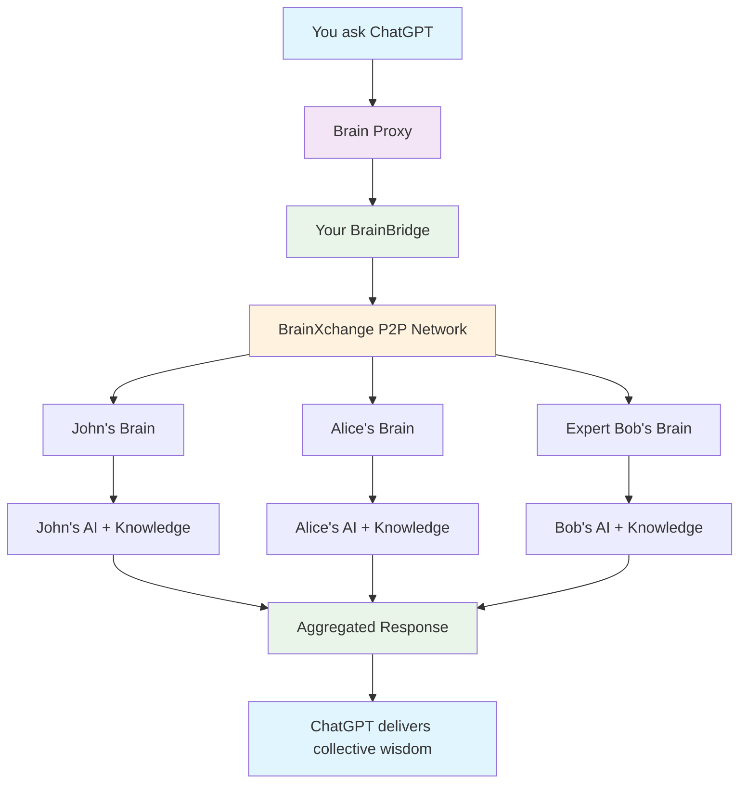

# 🌐 P2P Collective Intelligence: The Future of AI Networking

> **Vision**: Transform ChatGPT into a collective intelligence orchestrator that taps into your entire friend network's knowledge and expertise.

---

## 🎯 **The Revolutionary Concept**

Imagine asking ChatGPT: *"What's the consensus from my dev friends about GraphQL?"* and getting responses from John (React expert), Alice (backend specialist), and Bob (GraphQL maintainer) - all **automatically aggregated** through your P2P network.

This isn't just P2P messaging. This is **collective intelligence at scale**.

---

## 🚀 **What Makes This Incredible**

### **🧠 Network Intelligence**
Your ChatGPT becomes a **gateway to human expertise networks**:
- Query specific friends by their expertise
- Discover who in your network knows about any topic
- Get consensus opinions from multiple experts
- Access knowledge that no single AI possesses

### **🔒 Privacy-First Architecture**
- **Friends control sharing** - granular permissions per topic
- **Zero data harvesting** - knowledge stays with owners
- **Audit trails** - full transparency of what's shared
- **Your brain as relay** - you control all interactions

### **⚡ Real-Time Collective Responses**
- **Sub-5 second queries** across multiple friend networks
- **Automatic aggregation** of responses with confidence scoring
- **Expertise routing** - questions go to the right people
- **Fallback handling** when friends are offline

---

## 🌟 **Mind-Blowing Use Cases**

### **Professional Expertise Networks**
```
You: "Ask my engineer friends about Kubernetes best practices"
ChatGPT → [queries John, Alice, DevOps-Bob simultaneously]
Response: "Consensus from 3 engineers: Use Helm for deployments (John), 
          implement proper resource limits (Alice), monitor with Prometheus (Bob).
          Confidence: 95% agreement on these core practices."
```

### **Learning & Research Networks**
```
You: "Who in my network has experience with machine learning?"
ChatGPT → [scans friend expertise profiles]
Response: "Found 4 ML experts: Dr. Smith (research), Alice (MLOps), 
          Chen (PyTorch), Maria (computer vision). Would you like me 
          to ask them about a specific ML topic?"
```

### **Decision Support Networks**
```
You: "Get opinions from my startup founder friends about pricing strategy"
ChatGPT → [queries founder network with context]
Response: "3 founders responded: Sarah suggests freemium model, 
          Mike recommends value-based pricing, Lisa advises A/B testing.
          Common theme: Start with market research."
```

### **Creative Collaboration Networks**
```
You: "Ask my designer friends for feedback on this UI concept"
ChatGPT → [shares concept with design network]
Response: "Design feedback from 2 professionals: Emma loves the color scheme,
          suggests improving contrast. David recommends simplifying navigation.
          Both agree the overall direction is strong."
```

---

## 🏗️ **Revolutionary Architecture**

### **The Collective Intelligence Flow**


### **Privacy-Preserving Design**
- **Your brain acts as relay** - friends never share tokens with ChatGPT
- **Granular permissions** - friends control what topics they share
- **Zero data retention** - responses flow through, not stored
- **Audit transparency** - you see exactly what was asked/shared

---

## 🎪 **The Experience: From Your Perspective**

### **Seamless Integration**
Your ChatGPT conversations gain superpowers without complexity:

```
Normal ChatGPT:
You: "How should I structure a React app?"
ChatGPT: [gives generic AI response]

Collective Intelligence ChatGPT:
You: "How should I structure a React app?"
ChatGPT: "Let me ask your React expert friends... 
         John (Senior React Dev) suggests feature-based structure,
         Alice (Architecture Lead) recommends domain-driven design.
         Both use TypeScript. Would you like specific examples?"
```

### **Expertise Discovery**
Never wonder "who should I ask?" again:

```
You: "I need help with machine learning"
ChatGPT: "Found ML experts in your network:
         • Dr. Smith - Deep learning research, 10+ papers
         • Alice - MLOps at Tesla, production experience  
         • Chen - PyTorch contributor, computer vision
         Which aspect of ML do you need help with?"
```

### **Consensus Building**
Get wisdom of crowds from your trusted network:

```
You: "Should our startup use microservices?"
ChatGPT: "Asking your CTO friends... 
         [3/5 responded]
         60% say start monolithic, 40% say microservices from day 1
         Key factors: team size (all agree), complexity (split opinion)
         Would you like me to ask about your specific context?"
```

---

## 🚀 **From Your Friends' Perspective**

### **Controlled Sharing**
Friends set exactly what they're comfortable sharing:

```json
{
  "permissions": {
    "allowQuery": true,
    "categories": ["programming", "startups", "cooking"],
    "blocked": ["personal", "financial", "health"],
    "rateLimit": "5 queries/day",
    "responseMode": "ai-generated" // vs "direct-access"
  }
}
```

### **Reciprocal Value**
When you help others, they help you:
- **Expertise exchange** - teach React, learn Python
- **Network effects** - introductions to their networks
- **Karma system** - helpful contributors get priority access

### **Privacy Control**
- **Selective availability** - appear online only for certain topics
- **Anonymous contributions** - share knowledge without attribution
- **Temporary sharing** - time-limited access to sensitive expertise

---

## 🌍 **The Network Effect Revolution**

### **Expertise Amplification**
- **1 expert → 100 people benefit** through network sharing
- **Knowledge compounds** as experts learn from each other
- **Specialization rewards** - become *the* expert in your network

### **Cross-Pollination**
- **Bridge networks** - connect disparate expert communities
- **Multi-domain insights** - combine expertise across fields
- **Innovation acceleration** - faster problem-solving through collective intelligence

### **Democratic Knowledge**
- **Break information silos** - democratize access to expertise
- **Reduce consultant dependency** - tap your network first
- **Crowd-sourced solutions** - better answers through diversity

---

## 🔮 **Future Possibilities**

### **Multi-Hop Intelligence**
```
You ask → Your network → Friends of friends → Expert networks
"Find the world's leading expert on quantum computing applications"
```

### **AI-to-AI Collaboration**
```
Your AI + John's AI + Alice's AI = Collective reasoning beyond human capability
```

### **Global Knowledge Markets**
```
Monetize your expertise: "Earn tokens by sharing Python knowledge"
```

### **Specialized Networks**
```
Medical expertise network, Legal advice network, Investment insights network
```

---

## 💡 **Why This Changes Everything**

### **For Individuals**
- **Access to superhuman intelligence** through collective expertise
- **Never be stuck alone** with complex problems
- **Continuous learning** from network interactions
- **Expertise monetization** opportunities

### **For Networks**
- **Collective problem-solving** that beats individual AI
- **Knowledge preservation** across career changes
- **Community building** around shared expertise
- **Network resilience** through distributed knowledge

### **For AI Development**
- **Human-AI symbiosis** instead of replacement
- **Context-aware responses** from real human experience
- **Ethical AI alignment** through human network oversight
- **Continuous learning** from network interactions

---

## 🎯 **The Competitive Advantage**

This isn't just a feature - it's a **fundamental paradigm shift**:

### **vs. Traditional AI**
- ❌ **Static training data** → ✅ **Live human expertise**
- ❌ **Generic responses** → ✅ **Personalized network wisdom**  
- ❌ **Isolated AI** → ✅ **Collective intelligence**

### **vs. Social Networks**
- ❌ **Passive consumption** → ✅ **Active intelligence networking**
- ❌ **Algorithm-driven feeds** → ✅ **Expertise-driven queries**
- ❌ **Time-wasting scrolling** → ✅ **Purpose-driven knowledge exchange**

### **vs. Professional Networks**
- ❌ **Manual networking** → ✅ **AI-orchestrated connections**
- ❌ **Static profiles** → ✅ **Dynamic expertise matching**
- ❌ **One-to-one communication** → ✅ **Many-to-many intelligence**

---

## 🌟 **The Vision Statement**

> **"Magi P2P transforms ChatGPT from a single AI assistant into a collective intelligence orchestrator that connects you to the wisdom of your entire professional and personal network - creating superhuman problem-solving capability while preserving privacy, autonomy, and human agency."**

This is **the future of AI**: not replacing human intelligence, but amplifying and connecting it at unprecedented scale.

---

**Ready to build the collective intelligence revolution?** 🚀

*Next: [P2P Architecture Deep Dive](./P2P_ARCHITECTURE.md)*