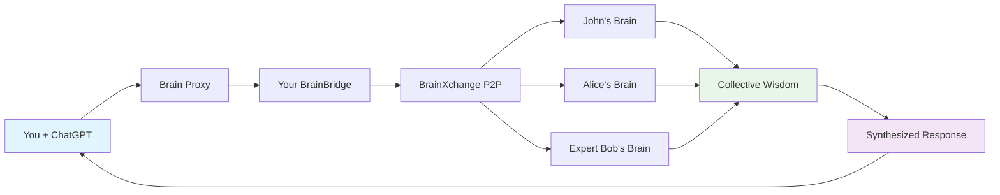

# 🌐 P2P Collective Intelligence Documentation

> **The future of AI**: Transform ChatGPT from a single assistant into a collective intelligence orchestrator that taps into your entire friend network's expertise.

---

## 📚 **Documentation Index**

### **🎯 [Collective Intelligence Vision](./P2P_COLLECTIVE_INTELLIGENCE.md)**
**The revolutionary concept that changes everything**
- Mind-blowing use cases and possibilities
- Why this transforms AI forever
- The competitive advantage of collective intelligence
- Emotional and social impact

### **🏗️ [Technical Architecture](./P2P_ARCHITECTURE.md)**  
**Deep dive into the technical implementation**
- Complete data flow architecture
- Component-by-component breakdown
- Privacy & security architecture
- Performance and scalability design

### **🎭 [User Experience Design](./P2P_USER_EXPERIENCE.md)**
**The magical experience users will have**
- Before vs. after comparison
- User personas and journey flows
- Interface design and interactions
- Social dynamics and network effects

### **🗺️ [Implementation Roadmap](./P2P_IMPLEMENTATION_ROADMAP.md)**
**Step-by-step plan to build collective intelligence**
- 4-phase development timeline
- Technical requirements and team needs
- Risk mitigation and success metrics
- From concept to global network

---

## 🚀 **Quick Start: Understanding P2P Collective Intelligence**

### **What Is This?**
P2P Collective Intelligence transforms your ChatGPT from a single AI assistant into a **network orchestrator** that can:

- **Query your friends' expertise** through natural conversation
- **Build consensus** from multiple expert opinions  
- **Discover specialists** in your network for any topic
- **Aggregate wisdom** from your entire professional network

### **The Magic in Action**
```
You: "Ask my dev friends about GraphQL vs REST"
ChatGPT: "Consulting your developer network...

📊 Responses from 4 senior developers:
• John (React specialist): "GraphQL for complex UIs, REST for simple APIs"
• Alice (Backend architect): "GraphQL adds complexity but worth it for mobile"
• Bob (Full-stack): "Start with REST, evolve to GraphQL when needed"  
• Maria (Tech lead): "GraphQL shines with multiple client types"

💭 Consensus: GraphQL preferred for complex, multi-client applications. 
REST recommended for simple, single-client APIs.

Agreement level: 75% - Generally aligned with nuanced differences.
Want me to ask about your specific use case?"
```

### **Why This Is Revolutionary**
- **🧠 Superhuman Intelligence**: Access collective wisdom beyond any individual AI
- **🔒 Privacy-First**: Friends control exactly what they share
- **⚡ Real-Time**: Get expert opinions in seconds, not hours
- **🎯 Context-Aware**: Responses tailored to your specific needs
- **🌍 Network Effects**: The more connections, the smarter your AI becomes

---

## 🎯 **Core Concepts**

### **Collective Intelligence**
Your ChatGPT becomes a gateway to human expertise networks, automatically finding and consulting the right people for any question.

### **Privacy-Preserving Architecture**  
Your brain acts as a relay - friends never share tokens with ChatGPT directly. You control all interactions and maintain complete transparency.

### **Expertise-Based Routing**
The system intelligently routes questions to friends with relevant expertise, ensuring you get the best possible advice.

### **Consensus Building**
Multiple perspectives are automatically aggregated into coherent insights, highlighting both consensus views and valuable minority opinions.

---

## 🏗️ **System Architecture Overview**



**Key Components:**
- **ChatGPT Interface**: Natural conversation with P2P superpowers
- **Brain Proxy**: Secure routing and authentication layer
- **BrainBridge**: Your personal AI gateway and relay
- **BrainXchange P2P**: Decentralized friend network protocol
- **Friend Brains**: Connected expertise from your network

---

## 🎪 **Implementation Phases**

### **Phase 1: Basic Network Queries** (4-6 weeks)
Enable ChatGPT to query individual friends
```
"Ask John about React patterns"
```

### **Phase 2: Multi-Friend Intelligence** (6-8 weeks)  
Parallel queries and consensus building
```
"Get consensus from my dev friends about microservices"
```

### **Phase 3: Collective Intelligence** (8-10 weeks)
Multi-hop queries and AI-to-AI collaboration
```
"Find the world's leading expert on quantum computing"
```

### **Phase 4: Global Networks** (10-12 weeks)
Expertise markets and cross-platform integration
```
"Connect me to the medical AI network for this diagnosis"
```

---

## 💡 **Use Cases & Examples**

### **Professional Decision Making**
- **Startup Strategy**: "Ask my founder friends about pricing models"
- **Technical Architecture**: "Get opinions from senior engineers about our stack"
- **Career Guidance**: "What do industry leaders think about this role?"

### **Learning & Research**
- **Skill Development**: "Who in my network can teach me machine learning?"
- **Research Collaboration**: "Find experts on interdisciplinary AI ethics"  
- **Best Practices**: "What are the latest trends in my field?"

### **Creative Projects**
- **Design Feedback**: "Get input from my designer friends on this UI"
- **Writing Collaboration**: "Ask writers in my network about this concept"
- **Innovation Brainstorming**: "Combine perspectives from different domains"

---

## 🔒 **Privacy & Security**

### **Core Privacy Principles**
- **User Control**: You decide what to share with whom
- **Granular Permissions**: Category-level sharing controls
- **Transparent Auditing**: Full visibility into all interactions
- **Data Minimization**: No unnecessary data collection or storage

### **Friend Permission System**
Friends set detailed preferences:
```json
{
  "categories": ["programming", "startups"],
  "blocked": ["personal", "financial"],
  "rate_limit": "5 queries/day",
  "trust_level": "professional"
}
```

### **Security Features**
- **Encrypted Communication**: All P2P traffic encrypted
- **Authentication**: Multi-layer token validation
- **Rate Limiting**: Prevent abuse and spam
- **Audit Trails**: Complete interaction logging

---

## 🚀 **Getting Started**

### **For Developers**
1. **Read the [Architecture Guide](./P2P_ARCHITECTURE.md)** for technical details
2. **Review the [Implementation Roadmap](./P2P_IMPLEMENTATION_ROADMAP.md)** for development plans
3. **Check existing BrainXchange foundation** in `/services/brainbridge/`

### **For Product Managers**
1. **Explore the [User Experience Guide](./P2P_USER_EXPERIENCE.md)** for UX flows
2. **Review the [Vision Document](./P2P_COLLECTIVE_INTELLIGENCE.md)** for market opportunity
3. **Study implementation phases** for roadmap planning

### **For Users (Future)**
1. **Connect your first friend** through BrainXchange invitation
2. **Set up privacy preferences** for comfortable sharing
3. **Start with simple queries** through ChatGPT interface

---

## 🌟 **The Future Vision**

P2P Collective Intelligence represents a fundamental shift in human-AI interaction:

**From**: Individual AI assistants with static knowledge  
**To**: Dynamic networks of human expertise accessible through AI

**From**: Isolated problem-solving  
**To**: Collaborative intelligence at global scale

**From**: Generic responses  
**To**: Personalized wisdom from trusted networks

This is **the future of AI** - not replacing human intelligence, but amplifying and connecting it at unprecedented scale while preserving privacy, autonomy, and human agency.

---

## 📞 **Support & Community**

- **Documentation Issues**: File issues in the main repository
- **Feature Requests**: Use the P2P feature request template
- **Development Questions**: Join the developer Discord
- **Privacy Concerns**: Review our privacy documentation

---

**Ready to build the collective intelligence revolution?** 🌐🚀

*This documentation represents the bleeding edge of AI network technology - join us in building the future!*