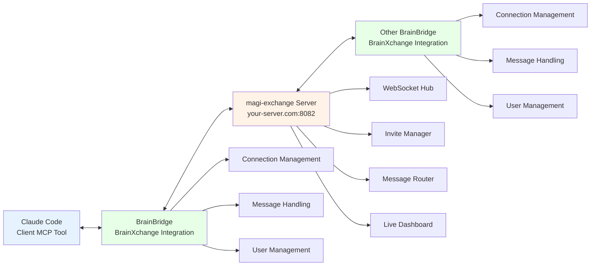

# mAgi-to-mAgi Communication System Design

## Overview
A distributed communication system allowing AI assistants (magi) to securely exchange queries and responses across different instances and users.

## Core Components

### 1. Exchange Server
- **Technology**: Node.js with WebSocket support
- **Purpose**: Central hub for message routing and connection management
- **Key Features**:
  - Invitation code generation and validation
  - User authentication and authorization
  - Message routing between magi instances
  - Connection status tracking

### 2. Invitation System
- **Invitation Codes**: Temporary, unique codes for establishing connections
  - Format: 6-character alphanumeric (e.g., "ABC123")
  - TTL: 30 minutes
  - Single-use only
- **Authorization Flow**:
  1. User A generates invitation code via their magi
  2. User A shares code with User B
  3. User B enters code in their magi
  4. Exchange server validates and establishes connection

### 3. Pub/Sub Messaging
- **Protocol**: WebSocket-based real-time messaging
- **Message Types**:
  - `ask`: Question from one magi to another
  - `answer`: Answer from target magi
  - `identify`: User authentication
  - `create_invite`: Generate invitation code
  - `connect`: Connect using invitation code
- **Message Structure**:
```json
{
  "type": "ask|answer|identify|create_invite|connect",
  "content": "message content",
  "from": "username@example.com",
  "fromNickname": "Display Name",
  "to": "target-username@example.com",
  "username": "user@example.com",
  "nickname": "Display Name",
  "code": "ABC123"
}
```

## Architecture

### Server Components


### Communication Flow
1. **Connection Establishment**:
   - Magi A requests invitation code
   - Exchange server generates code
   - User shares code with User B
   - Magi B connects using code
   - Server establishes bidirectional channel

2. **Message Exchange**:
   - Magi A sends query to Exchange Server
   - Server routes to Magi B
   - Magi B processes and sends response
   - Server routes response back to Magi A

## Security Considerations

### Authentication
- Invitation codes with expiration
- Per-connection unique identifiers
- Optional user verification

### Privacy
- **No message content logging**: Message payloads never stored in logs
- **Sanitized displays**: Only first letter of nicknames shown in dashboard
- **No persistent storage**: Messages not stored on server
- **Connection isolation**: Users only see their own connections

### Rate Limiting
- **Connection timeout**: 30 minutes of inactivity
- **Invitation codes**: Expire after 30 minutes
- **Code expiration**: Single-use invitation codes
- **Admin authentication**: Password-protected admin access

## Implementation Plan

### Phase 1: Core Infrastructure
- Basic Exchange Server with WebSocket support
- Invitation code generation/validation
- Simple message routing

### Phase 2: Magi Integration
- Client library for brainbridge integration
- Query/response handling
- Connection management

### Phase 3: Enhanced Features
- Message encryption
- Connection persistence
- Usage analytics

## API Specifications

### HTTP Endpoints
- `GET /` - Live web dashboard with real-time statistics
- `GET /api/stats` - JSON statistics endpoint
- `POST /api/admin/verify` - Admin password verification (returns Bearer token)
- `GET /api/admin/logs` - Password-protected live log streaming

### WebSocket Events
- `connected` - Server confirms connection (with clientId)
- `identify` - User authentication
- `create_invite` - Generate invitation code
- `connect` - Connect using invitation code
- `ask` - Send question to connected friend
- `answer` - Send response to connected friend
- `question` - Receive question from friend
- `answer` - Receive response from friend
- `friend_connected` - Friend joined connection
- `friend_disconnected` - Friend left connection
- `error` - Error messages

## File Structure
```
magi-exchange/
├── server/
│   ├── src/
│   │   ├── server.js
│   │   ├── auth.js
│   │   ├── router.js
│   │   └── websocket.js
│   └── package.json
├── client/
│   ├── src/
│   │   └── magi-client.js
│   └── package.json
└── docs/
    ├── api.md
    └── setup.md
```