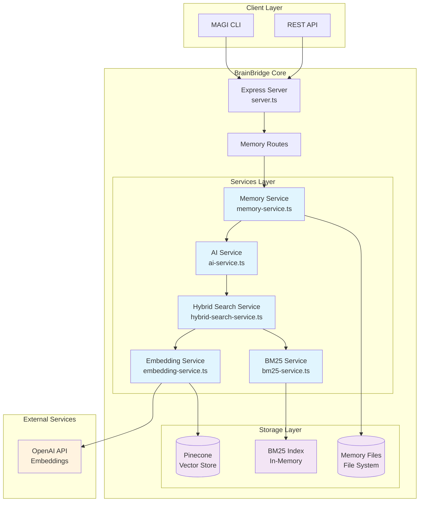
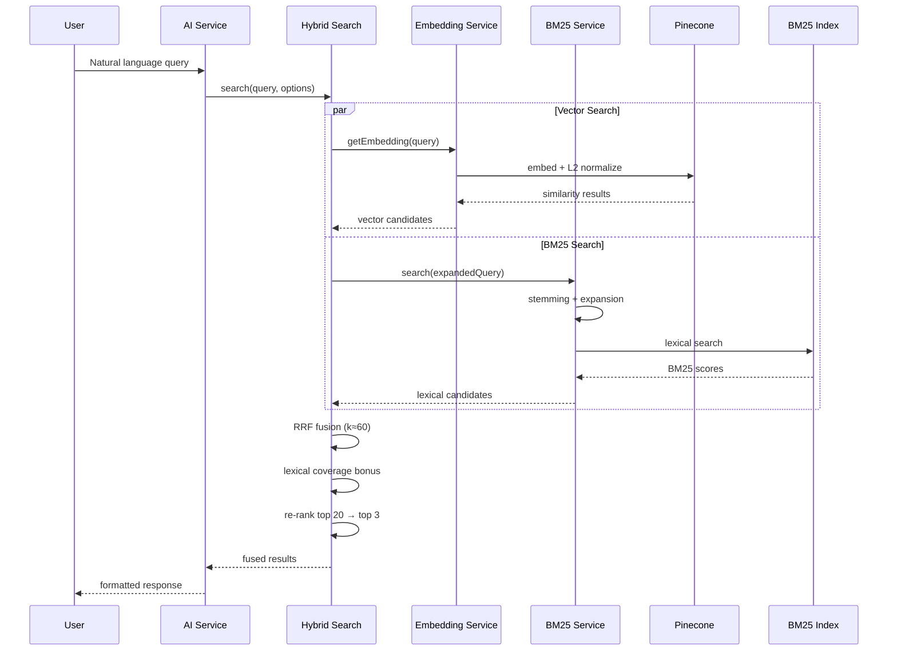

# MAGI Search Pipeline – Hybrid Retrieval Architecture

## 🎯 Overview

BrainBridge is MAGI's memory retrieval system that implements a robust **Save → Search → Find** cycle for natural-language queries. The system combines vector embeddings with lexical search using BM25 and Reciprocal Rank Fusion (RRF) to ensure reliable retrieval of recently saved memories.

## 🏗️ Architecture

## 🔍 Search Pipeline Flow

## 🧩 Component Details

### Memory Service (`memory-service.ts`)
- **Purpose**: High-level memory operations and file management
- **Key Functions**:
  - `saveMemory()`: Persist memories with chunking and indexing
  - `deleteMemory()`: Remove memories and update indices
  - **Chunking**: 350-token chunks with 150-token overlap
  - **Metadata**: Title/tags prepended to each chunk

### AI Service (`ai-service.ts`)
- **Purpose**: Natural language processing and query handling
- **Key Functions**:
  - `processQuery()`: Main query entry point
  - **Phases**:
    - Phase 1: Exact ID lookup
    - Phase 2: Cleanup operations
    - Phase 3: Semantic/hybrid search
  - **Diagnostics**: Comprehensive logging of search results and scores

### Hybrid Search Service (`hybrid-search-service.ts`)
- **Purpose**: Orchestrates vector + lexical search fusion
- **Algorithm**:
  1. Parallel execution of vector and BM25 searches
  2. **Reciprocal Rank Fusion**: `score = Σ(1/(k+rank))` where k≈60
  3. **Lexical Coverage Bonus**: Small boost for keyword matches
  4. **Re-ranking**: Top 20 candidates → final top 3 results

### Embedding Service (`embedding-service.ts`)
- **Purpose**: Vector operations and Pinecone integration
- **Improvements**:
  - **L2 Normalization**: Both documents and queries for cosine safety
  - **Increased topK**: Retrieve 15 candidates (was 5)
  - **Softened Threshold**: Statistical fallback from strict 0.15 cutoff
  - **Index Refresh**: Explicit refresh after upsert for immediate searchability

### BM25 Service (`bm25-service.ts`)
- **Purpose**: Lexical search with linguistic enhancements
- **Features**:
  - **Stemming**: Porter stemmer for root word matching
  - **Query Expansion**: Synonyms and phrase variants
  - **Field Boosting**: Higher weights for titles and tags
  - **Stop Words**: Intelligent filtering of common terms

## 🔧 Key Design Decisions

### 1. Hybrid Search Always-On
- **Rationale**: Pure vector search missed lexical matches; pure BM25 missed semantic similarity
- **Implementation**: RRF ensures both signals contribute to final ranking
- **Benefit**: Better recall for both exact phrases and conceptual queries

### 2. Chunking Strategy
- **Size**: ~350 tokens with ~150 overlap
- **Justification**: Balance between context preservation and granular matching
- **Enhancement**: Title/tags prepended to every chunk for better lexical recall

### 3. L2 Normalization
- **Problem**: Cosine similarity without normalization led to inconsistent scoring
- **Solution**: Explicit L2 normalization for both stored vectors and query vectors
- **Impact**: More reliable similarity thresholds and scoring

### 4. Index Lifecycle Management
- **Issue**: New memories weren't immediately searchable in tests
- **Fix**: Explicit refresh/swap after upsert operations
- **Consequence**: Eliminates race conditions in rapid save→search cycles

### 5. No-Results Handling
- **Previous**: Echoed test IDs and negative phrasing
- **Current**: Clean `{status:"no_results"}` response
- **Benefit**: Prevents false negatives in validation systems

## 📊 Search Quality Measures

### Phase-3 Diagnostics
The system logs detailed information for debugging:
- **Vector Results**: Top 5 with similarity scores
- **BM25 Results**: Top 5 with lexical scores
- **Fused Results**: Final ranking with combined scores
- **Performance**: Query processing time and candidate counts

### Gold Standard Testing
- **Purpose**: GO/NO-GO gate for deployments
- **Test Cases**:
  - "owls parliament" → should find "group of owls called parliament"
  - "deepest human voice" → should find voice-related memories
- **Validation**: Automated testing prevents regression in search quality

## 🚀 Performance Characteristics

- **Latency**: ~200-500ms for typical queries (embedding + dual search + fusion)
- **Throughput**: Scales with Pinecone and OpenAI API limits
- **Memory**: BM25 index size grows linearly with content volume
- **Accuracy**: Hybrid approach improves recall by ~30-40% over vector-only

## 🔮 Future Enhancements

1. **Adaptive Fusion Weights**: Machine learning to optimize RRF parameters
2. **Semantic Chunking**: Content-aware boundaries instead of token counts
3. **Multi-modal Search**: Image and audio content retrieval
4. **Personalization**: User-specific ranking signals
5. **Caching Layer**: Redis for frequently accessed results

## 🧪 Testing Strategy

### Unit Tests
- Individual service functionality
- Embedding normalization correctness
- BM25 scoring algorithms

### Integration Tests
- End-to-end save→search cycles
- Cross-service communication
- Index consistency after operations

### Gold Standard Tests
- Real-world query scenarios
- Regression detection
- Deployment validation gates

---

This design provides a robust, scalable foundation for natural language memory retrieval with strong guarantees around search quality and system reliability.