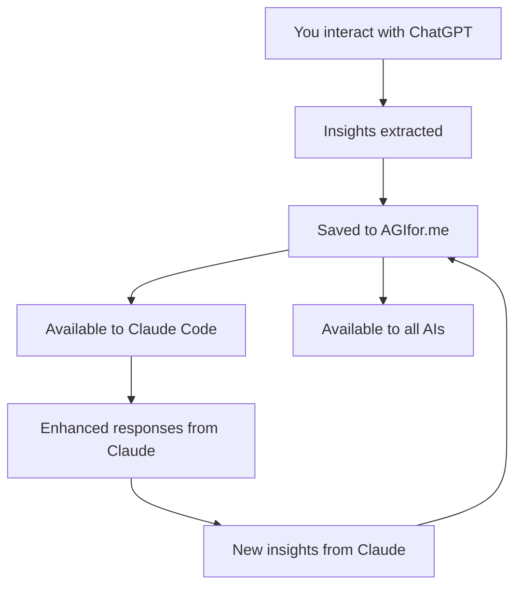

# Personal AI Knowledge Hub

## Overview
**Scenario**: You use multiple AI assistants (ChatGPT, Claude, Gemini, local models) and want them ALL to have access to your curated knowledge and memories  
**User Goal**: Central repository that enhances every AI interaction with your personal context  
**Value Demonstration**: Your knowledge follows you across all AI platforms, creating consistent, personalized experiences

## The Multi-AI Reality

### Your Current AI Workflow
You use different AI assistants for different tasks:

```
Morning: ChatGPT for email drafts and planning
Workday: Claude Code for development and architecture  
Evening: Gemini for research and creative writing
Weekend: Local Llama model for private financial planning
```

**The Problem**: Each AI starts from zero. No memory of your preferences, past decisions, or hard-won insights.

**The Solution**: AGIfor.me as your **central knowledge repository** that ALL AIs can access (with your permission).

## The Personal Hub Experience

### Step 1: Your Knowledge Accumulates Centrally
Over time, you build a rich memory bank:

```
memories/
├── personal/
│   ├── communication-style.md      # "I prefer direct, concise responses"
│   ├── decision-frameworks.md      # Your personal decision-making process
│   └── learning-preferences.md     # How you like information presented
├── professional/
│   ├── coding-standards.md         # Your preferred patterns and practices
│   ├── architecture-decisions.md   # Past technical choices and reasoning
│   └── management-philosophy.md    # Leadership approach and team dynamics
├── private/
│   ├── financial-goals.md          # Investment strategy and constraints
│   ├── health-tracking.md          # Fitness goals and medical history
│   └── life-optimization.md        # Personal productivity systems
└── team/
    ├── project-context.md          # Current work priorities and context
    ├── meeting-notes.md            # Key decisions and action items
    └── team-dynamics.md            # Working relationships and communication styles
```

### Step 2: Multi-AI Integration in Action

**Morning with ChatGPT**:
```
You: "Draft an email declining the vendor meeting"

ChatGPT queries your AGIfor.me → Gets your communication style preferences

ChatGPT: "Based on your preference for direct, respectful communication:

'Hi [Name],

Thank you for reaching out about [product]. After review, we won't be 
moving forward at this time due to budget constraints this quarter.

I'll keep you in mind for future opportunities.

Best regards,
Igor'

This matches your preferred tone: direct but warm, with specific reasoning."
```

**Workday with Claude Code**:
```
You: "Help me architect the authentication system"

Claude queries your AGIfor.me → Gets your coding standards and past decisions

Claude: "Based on your architecture decisions, you prefer:
- JWT tokens over sessions (decision from user-service project)
- Auth0 integration for enterprise clients (learned from client-portal)
- Local auth for personal tools (privacy-first approach)

For this project, I recommend JWT + Auth0 since you noted 'enterprise 
features are priority' in your current project context.

Here's the implementation following your TypeScript standards..."
```

**Evening with Gemini**:
```
You: "Research investment strategies for tech workers"

Gemini queries your AGIfor.me → Gets your financial goals and constraints

Gemini: "Based on your financial profile:
- 10-year investment horizon
- Risk tolerance: moderate-aggressive  
- Focus: tech sector expertise
- Constraint: avoid individual stock picking (learned from 2022 losses)

Here are strategies aligned with your goals:
1. Tech-heavy index funds (matches your sector knowledge)
2. Dollar-cost averaging (matches your systematic approach)
3. International diversification (addresses your portfolio concentration risk)

This avoids the individual stock picking that you noted 'cost me $15K in 2022'."
```

**Weekend with Local Model (Private)**:
```
You: "Help me plan my financial independence timeline"

Local Model accesses your private memories → Complete financial picture

Local Model: "Based on your private financial data:
- Current savings rate: 35% (above your 30% target)
- Investment timeline: On track for FI in 12 years vs 15-year goal
- Risk: Single income source (noted concern from last review)

Recommendations:
1. Continue current aggressive saving (working well)
2. Consider side income development (addresses risk concern)  
3. Increase international allocation to 20% (portfolio optimization)

Your systematic approach is working - you're ahead of schedule."
```

## Cross-AI Memory Patterns

### Communication & Preferences
```markdown
# File: memories/personal/communication-style.md

## My Communication Preferences
- **Tone**: Direct but respectful, avoid corporate speak
- **Length**: Concise by default, detailed when I ask for "comprehensive"
- **Format**: Bullet points and structured thinking preferred
- **Context**: Always explain the "why" behind recommendations

## Email Style
- Subject lines: Specific and actionable
- Greeting: "Hi [name]" for external, skip for internal  
- Body: Lead with conclusion, then supporting details
- Closing: "Best regards" for formal, "Thanks" for casual

## Meeting Communication
- Agenda: Always have one, share in advance
- Follow-up: Send notes with clear action items and owners
- Questions: Ask specific, actionable questions
- Feedback: Direct but constructive, focus on outcomes
```

### Technical Context & Decisions
```markdown
# File: memories/professional/architecture-decisions.md

## Technical Decision Patterns

### Database Choices
- **Default**: PostgreSQL (reliable, feature-rich, good performance)
- **Avoid**: MongoDB unless document structure truly dynamic
- **Lesson**: "Switched from Mongo to Postgres in user-service, cut query time 60%"

### Authentication Strategies  
- **Enterprise clients**: Auth0 integration (SSO requirements)
- **Personal projects**: Local JWT auth (privacy control)
- **Team tools**: Google OAuth (existing G-Suite integration)

### API Design Philosophy
- **REST by default**, GraphQL only when client complexity justifies it
- **Version all APIs** from day one (learned from client-api breaking changes)
- **Document with OpenAPI** spec, not just comments
- **Rate limiting** on all external endpoints (learned from DoS incident)

### Technology Selection Criteria
1. **Community size** and long-term viability
2. **Learning curve** for team members  
3. **Performance** characteristics for use case
4. **Maintenance burden** over time
```

### Financial & Life Context
```markdown
# File: memories/private/financial-goals.md

## Financial Independence Timeline
- **Target**: Financial independence by age 45 (12 years from now)
- **Strategy**: Aggressive saving (35% rate) + index fund investing
- **Risk tolerance**: Moderate-aggressive (can handle 30-40% portfolio swings)

## Investment Philosophy
- **Core holding**: Total stock market index funds (70%)
- **International**: Developed + emerging markets (20%)  
- **Bonds**: Small allocation for stability (10%)
- **Individual stocks**: Avoid (learned from 2022 $15K loss)

## Constraints & Considerations
- **Income**: Single source (startup salary + equity)
- **Risk concern**: Job market volatility in tech
- **Hedge**: Building side income through consulting/products
- **Expenses**: Optimize for time vs money (prefer paid tools that save hours)
```

## Multi-AI Integration Architecture

### AGIfor.me as Knowledge API
```typescript
interface AIIntegration {
  platform: 'chatgpt' | 'claude' | 'gemini' | 'local' | 'other';
  api_key: string;
  permissions: PrivacyLevel[];
  query_patterns: QueryPattern[];
  response_format: ResponseFormat;
}

interface QueryPattern {
  trigger: string;          // "draft email", "architect system", "research topic"
  memories_needed: string[];  // ["communication-style", "architecture-decisions"]
  privacy_filter: PrivacyLevel;  // What this AI can access
  response_enhancement: boolean; // Should AGIfor.me enhance the response?
}
```

### Privacy-Aware Cross-AI Access
```json
{
  "ai_permissions": {
    "chatgpt": {
      "allowed_privacy_levels": ["public", "personal"],  
      "forbidden_categories": ["financial", "health"],
      "reasoning": "Cloud-based, OpenAI data policy concerns"
    },
    "claude_code": {
      "allowed_privacy_levels": ["public", "personal", "team", "private"],
      "forbidden_categories": ["sensitive"],  
      "reasoning": "Local deployment, full trust"
    },
    "gemini": {
      "allowed_privacy_levels": ["public", "personal"],
      "forbidden_categories": ["financial", "health", "work"],
      "reasoning": "Google integration, privacy concerns"
    },
    "local_llama": {
      "allowed_privacy_levels": ["public", "personal", "team", "private", "sensitive"],
      "forbidden_categories": [],
      "reasoning": "Local model, complete privacy"
    }
  }
}
```

### Cross-AI Memory Synchronization
```typescript
class CrossAISync {
  // When you interact with any AI, relevant insights get saved back
  async syncLearning(
    ai_platform: string,
    interaction: AIInteraction,
    new_insights: Insight[]
  ) {
    // Add new insights to central knowledge base
    for (const insight of new_insights) {
      await this.addMemory(insight, this.determinePrivacyLevel(insight));
    }
    
    // Update preferences based on interaction patterns
    await this.updatePreferences(ai_platform, interaction);
    
    // Share relevant updates with other AIs (if permitted)
    await this.propagateUpdates(new_insights);
  }
}
```

## Benefits of Central Knowledge Hub

### For You
- **Consistency**: All AIs know your preferences and context
- **Continuity**: Conversations build on previous interactions across platforms
- **Privacy Control**: Decide what each AI can access
- **Learning Compound**: Insights from one AI inform all others
- **Time Savings**: No more repeating context to each AI

### For Your AIs
- **Better Responses**: Rich context leads to more relevant, personalized advice
- **Efficiency**: Less back-and-forth to understand your needs
- **Specialization**: Each AI can focus on what it does best while sharing knowledge
- **Learning**: Continuous improvement from your feedback patterns

## Implementation Patterns

### Morning Routine Enhancement
```bash
# Your morning AI briefing pulls from multiple sources
chatgpt_brief=$(curl chatgpt-api | enhance-with-memories "daily-planning")
claude_code_status=$(curl claude-api | enhance-with-memories "project-context") 
gemini_research=$(curl gemini-api | enhance-with-memories "research-interests")

# All informed by your central knowledge base
```

### Context-Aware Task Routing
```typescript
// Automatically route tasks to best AI with full context
const taskRouter = {
  "code architecture": "claude_code",    // Gets your technical decisions
  "email drafting": "chatgpt",          // Gets your communication style  
  "research analysis": "gemini",        // Gets your learning preferences
  "financial planning": "local_llama"   // Gets your private financial data
};
```

### Cross-Platform Learning Loop


## Privacy & Security Model

### Tiered Access Control
- **Cloud AIs** (ChatGPT, Gemini): Public + Personal memories only
- **Trusted Cloud** (Claude Code): Public + Personal + Team + Private 
- **Local AIs**: Full access including Sensitive memories
- **Third-party tools**: Public memories only (with explicit approval)

### Data Sovereignty
- **Your knowledge stays local** - AIs query it, don't store copies
- **Encryption in transit** for all AI integrations
- **Audit logs** of what each AI accessed and when
- **Revocation** - instantly cut off any AI's access

This personal AI hub transforms your scattered AI interactions into a cohesive, context-aware experience where your knowledge and preferences enhance every conversation across all platforms.